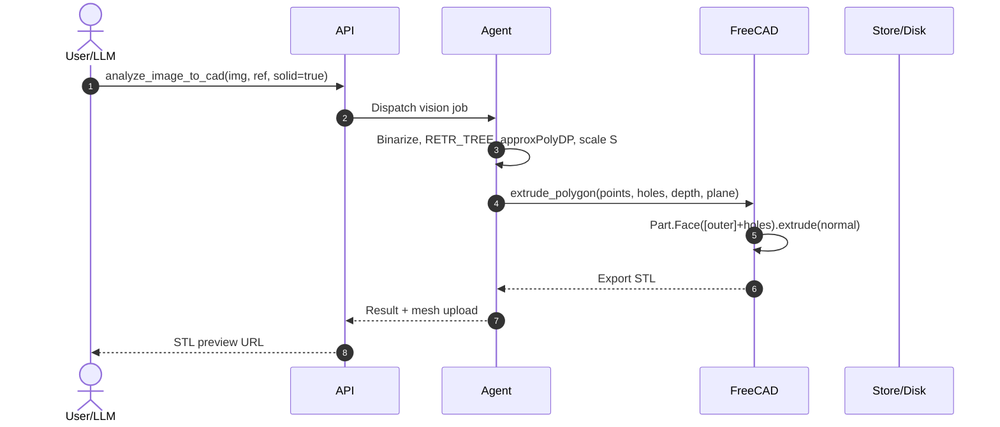

# Technical Design: CAD Engine Phase 5 — Image-to-CAD, OCR & Privacy

## 1. Architecture Decisions

### AD-01: Decoupled Computer Vision Pipeline (Host Agent vs FreeCAD)
- **Context**: FreeCADCmd's Python lacks OpenCV/numpy. Installing C-extensions risks DLL conflicts.
- **Choice**: Execute CV on the host agent (`cadgpt_agent/vision.py`) using `opencv-python-headless`: binarization (Otsu, adaptive, Canny), contour hierarchy (`RETR_TREE`) for outer boundaries and nested holes, Douglas-Peucker simplification (`approxPolyDP`, $\epsilon = 0.0025 \cdot L$), metric scale $S = \text{dim}_{mm} / D_{px}$, and inverted-Y coordinate mapping to FreeCAD.
- **Alternatives**: In-process FreeCAD CV (fragile); API-server processing (heavy server load).

### AD-02: Parametric 3D Typography via `Draft.make_shapestring` & Bundled Font
- **Context**: FreeCAD requires local TrueType fonts for 3D lettering. Headless OS instances lack system fonts.
- **Choice**: Bundle `Inter-Bold.ttf` in `agent/cadgpt_agent/fonts/`. Resolution: explicit path $\to$ bundled font $\to$ OS standard fonts (`Arial`, `DejaVuSans`). FreeCAD worker invokes `Draft.make_shapestring`, handles hollow counter-spaces, and supports `flat`, `emboss` (boolean union), and `engrave` (boolean cut) with atomic rollback.
- **Alternatives**: Contour text tracing (jagged, non-parametric geometry).

### AD-03: Dual-Gate Consent Governance (Keycloak Theme & Angular Gate)
- **Context**: Standard registration uses `register.ftl`, but Google SSO first-broker logins bypass it to the web callback.
- **Choice**: Deploy Stitch glassmorphic bottom sheet (`.stitch-consent-sheet`, `#consent-backdrop`, `translateY`, `#00F0FF`) in Keycloak `register.ftl`, plus an Angular gate checking `cadgpt:consent:v1:<sub_or_version>` blocking interaction until accepted.
- **Alternatives**: Keycloak required actions (complex realm orchestration).

### AD-04: Fail-Fast Atomic Account Deletion Cascade
- **Context**: Right to Erasure mandates full purge across Keycloak, SQLite, and disk meshes.
- **Choice**: Expose `DELETE /api/account` keyed strictly to JWT `sub` (anti-IDOR). Execution: (1) `KeycloakAdminService` calls `DELETE /admin/realms/{realm}/users/{sub}` (fails fast on 5xx); (2) unlink `<dataDir>/meshes/<jobId>.stl` and `.part` files; (3) SQLite transaction (`BEGIN IMMEDIATE ... COMMIT`) across 7 tables. Angular modal requires typing `"ELIMINAR"`.
- **Alternatives**: Soft deletion (violates GDPR); async cron purge (leaves active tokens).

---

## 2. Data Flow

---

## 3. Interfaces & Contracts

- **MCP `analyze_image_to_cad`**: `image_base64`, `reference_dimension?` (`{ type, value_mm, points? }`), `threshold_mode` (`otsu`|`adaptive`|`canny`), `invert`, `tolerance` ($[0.0001, 0.05]$), `create_solid`, `depth?`, `plane`, `position?`, `confirmed: true`.
- **MCP `create_text_3d`**: `text` (1–120 chars), `size`, `thickness`, `mode` (`flat`|`emboss`|`engrave`), `target_object?` (mandatory for emboss/engrave), `plane`, `position?`, `tracking?`, `font?`, `confirmed: true`.
- **Worker `extrude_polygon`**: `points` (3–100 coords), optional `holes` (up to 20 loops), extrudes `Part.Face([outer_wire] + hole_wires)`.
- **REST `DELETE /api/account`**: Bearer JWT (`cad:write`), purges `sub`, returns `204`.
- **`KeycloakAdminService`**: `deleteUser(sub)` calls `DELETE /admin/realms/{realm}/users/{sub}`.

---

## 4. File Changes

| File | Change | Purpose |
| :--- | :--- | :--- |
| `ops-allowlist.json` | Modify | Add `create_text_3d`, `analyze_image_to_cad` (20 ops total) |
| `agent/pyproject.toml` | Modify | Add `opencv-python-headless`, `numpy` |
| `agent/cadgpt_agent/fonts/Inter-Bold.ttf` | Add | Bundled sans-serif TrueType font |
| `agent/cadgpt_agent/discovery.py` | Modify | Export 20 ops in `FREECAD_OPS` |
| `agent/cadgpt_agent/vision.py` | Add | CV pipeline: Otsu/adaptive/Canny, RETR_TREE holes, DP, metric scaling |
| `agent/cadgpt_agent/freecad_worker.py` | Modify | `_create_text_3d` handler, font fallback, multi-wire `_extrude_polygon` |
| `apps/api/src/tools.ts` | Modify | Zod schemas for new ops; update `extrudePolygonSchema` |
| `apps/api/src/keycloak.ts` | Add | `KeycloakAdminService.deleteUser(sub)` |
| `apps/api/src/store.ts` | Modify | `deleteAccount` with mesh unlink & 7-table SQLite cascade |
| `apps/api/src/main.ts` | Modify | Wire `DELETE /api/account` route |
| `deploy/themes/cadgpt/login/register.ftl` | Add | Keycloak registration consent bottom sheet |
| `deploy/themes/cadgpt/login/resources/css/stitch.css` | Modify | `.stitch-consent-sheet` styles & `translateY` animations |
| `apps/web/src/app/core/auth/auth.service.ts` | Modify | Consent gate for Google SSO |
| `apps/web/src/app/pages/about/about.html` / `.ts` | Modify | Account deletion modal with `"ELIMINAR"` guard |

---

## 5. Threat Matrix

| Threat (STRIDE) | Sev | Mitigation |
| :--- | :--- | :--- |
| **IDOR Deletion** (Tampering) | High | Identity derived strictly from JWT `sub`; client params ignored. |
| **Orphan Identity** (Elevation) | High | Keycloak deletion precedes DB commit; 5xx aborts cascade. |
| **Kernel Freeze** (DoS) | Med | Douglas-Peucker simplification ($\epsilon = 0.0025 \cdot L$); max 100 pts/loop. |
| **Font Traversal** (Info) | Med | Restrict font files to `.ttf`/`.otf`; fallback to bundled font. |
| **Disk Leakage** (DoS) | Med | Unlink all user `.stl`/\`.part\` files before DB commit. |

---

## 6. Testing Strategy

- **Agent Tests**: `test_vision.py` (Otsu/adaptive/Canny, $\ge 60\%$ DP reduction, RETR_TREE holes, scale $S$, origin centering); `test_freecad_worker.py` (text modes, font fallback, multi-wire cutouts); `test_ops_allowlist.py` (20-op parity).
- **API Tests**: `tools.test.ts` (Zod schemas for new ops & hole loops); `store.test.ts` (7-table cascade, disk unlink, tenant isolation); `account.test.ts` (JWT `sub` extraction, 502 on Keycloak failure).
- **Web Tests**: Jasmine tests for Angular consent gate and typed `"ELIMINAR"` button enablement.
