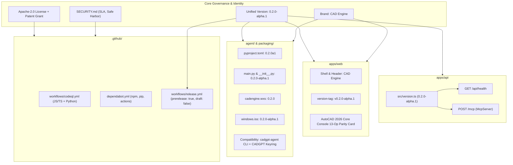

# Exploration: CAD Engine Governance, Versioning & Security

**Change ID:** `cadengine-governance-versioning-security`  
**Target Release:** `v0.2.0-alpha.1`  
**Date:** 2026-09-16  
**Status:** Completed  
**Author:** sdd-explore subagent  

---

## 1. Executive Summary

This exploration analyzes the repository to establish rigorous governance, unified versioning, commercial branding consistency, and automated security pipelines for **CAD Engine**.

Currently, the repository exhibits version fragmentation across its polyglot stack (Node.js/TypeScript root, Express/Nest API, Angular web dashboard, Python agent, and Windows WiX/Inno packaging scripts). Versions fluctuate between `0.0.0`, `0.1.0`, `0.1.0-alpha`, and `0.2.0`. Additionally:
1. The web interface and documentation describe AutoCAD support as "detected only / partial," despite the completion of Spike A and the implementation of 13-operation parity on AutoCAD 2026 Core Console (`accoreconsole.exe`).
2. Release workflows name the release step "Create draft only" while GitHub Releases API behaviors for draft vs. prerelease impact automated agent update checks.
3. Branding is split between legacy names ("CADGPT", "CAD Agent Designer") and the target product identity ("CAD Engine").
4. The repository lacks a root open-source license file, a formal `SECURITY.md` policy with vulnerability response SLAs, automated static application security testing (CodeQL), and dependency vulnerability auditing (Dependabot).

This document establishes the empirical findings, architectural decisions, and concrete implementation plans to align the entire project to **`v0.2.0-alpha.1`**, under the **Apache-2.0** license, with comprehensive security automation.

---

## 2. Codebase Audit & Current State Analysis

### 2.1 Version Divergence & Hardcoded Strings Audit

An exhaustive audit of the codebase revealed the following version declarations:

| Component / File Path | Current Declared Version | Mechanism / Scope | Planned Target |
|---|---|---|---|
| [package.json](file:///Users/danny/Documents/ChatGPT/CADGPT/package.json#L4) | `"version": "0.2.0"` | Root npm workspace configuration | `"0.2.0-alpha.1"` |
| [apps/api/package.json](file:///Users/danny/Documents/ChatGPT/CADGPT/apps/api/package.json#L4) | `"version": "0.2.0"` | Backend API package definition | `"0.2.0-alpha.1"` |
| [apps/web/package.json](file:///Users/danny/Documents/ChatGPT/CADGPT/apps/web/package.json#L3) | `"version": "0.0.0"` | Angular web dashboard package definition | `"0.2.0-alpha.1"` |
| [agent/pyproject.toml](file:///Users/danny/Documents/ChatGPT/CADGPT/agent/pyproject.toml#L6) | `version = "0.2.0"` | Python packaging metadata | `version = "0.2.0a1"` (PEP 440) |
| [agent/cadgpt_agent/__init__.py](file:///Users/danny/Documents/ChatGPT/CADGPT/agent/cadgpt_agent/__init__.py#L1) | *(empty)* | Python module export | `__version__ = "0.2.0-alpha.1"` |
| [agent/cadgpt_agent/main.py](file:///Users/danny/Documents/ChatGPT/CADGPT/agent/cadgpt_agent/main.py#L38) | `VERSION = "0.2.0"` | CLI constant (`cadengine version`) | `VERSION = "0.2.0-alpha.1"` |
| [apps/api/src/main.ts](file:///Users/danny/Documents/ChatGPT/CADGPT/apps/api/src/main.ts#L86) | `version: '0.1.0-alpha'` | `GET /api/health` JSON response | `version: '0.2.0-alpha.1'` |
| [apps/api/src/main.ts](file:///Users/danny/Documents/ChatGPT/CADGPT/apps/api/src/main.ts#L221) | `version: '0.1.0'` | `McpServer` constructor metadata | `version: '0.2.0-alpha.1'` |
| [apps/web/src/app/layout/shell/shell.html](file:///Users/danny/Documents/ChatGPT/CADGPT/apps/web/src/app/layout/shell/shell.html#L35) | `class="version-tag">alpha</span>` | Header badge UI | `v0.2.0-alpha.1` |
| [apps/web/src/app/layout/shell/shell.html](file:///Users/danny/Documents/ChatGPT/CADGPT/apps/web/src/app/layout/shell/shell.html#L179) | `— experimental alpha` | Footer status string | `— v0.2.0-alpha.1` |
| [packaging/wix/cadengine.wxs](file:///Users/danny/Documents/ChatGPT/CADGPT/packaging/wix/cadengine.wxs#L6) | `Version="0.1.0"` | MSI Package Version (`major.minor.build`) | `Version="0.2.0"` |
| [packaging/windows.iss](file:///Users/danny/Documents/ChatGPT/CADGPT/packaging/windows.iss#L4) | `AppVersion=0.1.0` | Inno Setup manifest | `AppVersion=0.2.0-alpha.1` |
| [apps/api/test/tools.test.ts](file:///Users/danny/Documents/ChatGPT/CADGPT/apps/api/test/tools.test.ts#L51) | `version: '0.0.0'` | Mock `McpServer` test fixture | Align to standard fixture |
| [agent/tests/test_agent.py](file:///Users/danny/Documents/ChatGPT/CADGPT/agent/tests/test_agent.py#L433-L467) | Imports `VERSION` from `main` | Asserts output format `cadengine v{VERSION}` | Verifies `0.2.0-alpha.1` |

**Key Findings:**
1. **PEP 440 Pre-Release Standard:** In `agent/pyproject.toml`, standard Python tooling (pip, build, setuptools) adheres to PEP 440 where `0.2.0-alpha.1` must be specified as `0.2.0a1` in wheel/sdist metadata, while exposing the human-readable semver string `"0.2.0-alpha.1"` via `__version__` and CLI flags.
2. **WiX v4 Windows Installer Restriction:** Windows Installer (MSI) enforces strict four-part decimal version format (`major.minor.build.revision` where major <= 255, minor <= 255, build <= 65535). String suffixes like `-alpha.1` are invalid syntax in `Package/@Version` in WiX. Therefore, `cadengine.wxs` must use `Version="0.2.0"` (or `0.2.0.1`), while `windows.iss` supports the full alphanumeric `0.2.0-alpha.1`.

---

### 2.2 /api/health and MCP Server Version Reporting

#### Health Endpoint Inspection
In [apps/api/src/main.ts](file:///Users/danny/Documents/ChatGPT/CADGPT/apps/api/src/main.ts#L85-L87):
```typescript
http.get('/api/health', (_: Request, r: Response) =>
  r.json({ status: 'ok', version: '0.1.0-alpha' }),
);
```
- **Consumer Analysis:** The agent CLI probes `/api/health` during `cadengine status` ([agent/cadgpt_agent/main.py:355](file:///Users/danny/Documents/ChatGPT/CADGPT/agent/cadgpt_agent/main.py#L355)) and `cadengine doctor` ([agent/cadgpt_agent/main.py:827](file:///Users/danny/Documents/ChatGPT/CADGPT/agent/cadgpt_agent/main.py#L827)). The Dockerfile also uses it for health checks ([Dockerfile:68](file:///Users/danny/Documents/ChatGPT/CADGPT/Dockerfile#L68)).
- **Issue:** The version string is hardcoded to `'0.1.0-alpha'`.

#### MCP Server Registration Inspection
In [apps/api/src/main.ts](file:///Users/danny/Documents/ChatGPT/CADGPT/apps/api/src/main.ts#L220-L223):
```typescript
const server = new McpServer(
  { name: 'cad-agent-designer', version: '0.1.0' },
  { instructions: SERVER_INSTRUCTIONS },
);
```
- **Consumer Analysis:** Every HTTP request to `POST /mcp` instantiates a new `McpServer`. Remote LLMs (Claude, ChatGPT Desktop) receive `{ name, version }` in the MCP initialize handshake (`protocolVersion`, `serverInfo`).
- **Issue:** The server name is `'cad-agent-designer'` and the version is hardcoded to `'0.1.0'`.

#### Unification Architecture
A centralized version definition module should be introduced:
- Create [apps/api/src/version.ts](file:///Users/danny/Documents/ChatGPT/CADGPT/apps/api/src/version.ts) exporting:
  ```typescript
  export const APP_VERSION = '0.2.0-alpha.1';
  export const SERVER_NAME = 'cad-engine';
  ```
- Reference `APP_VERSION` in both `/api/health` and `/mcp` initialization.
- Add an integration test suite in [apps/api/test/health.test.ts](file:///Users/danny/Documents/ChatGPT/CADGPT/apps/api/test/) to assert that `/api/health` returns `{ status: 'ok', version: '0.2.0-alpha.1' }`.

---

### 2.3 AutoCAD Compatibility Section & Capabilities Parity

#### Technical Capabilities Reality
In previous phases (Pillar 2 and Spike A, documented in [docs/autocad-op-parity-spike.md](file:///Users/danny/Documents/ChatGPT/CADGPT/docs/autocad-op-parity-spike.md) and implemented in [agent/cadgpt_agent/strategies/autocad.py](file:///Users/danny/Documents/ChatGPT/CADGPT/agent/cadgpt_agent/strategies/autocad.py)), the AutoCAD 2026 Core Console adapter achieved verified 13-operation parity:
1. **3D Primitives:** `create_box`, `create_cylinder`, `create_sphere`, `create_cone`, `extrude_rect` (via global `_BOX`, `_CYLINDER`, `_SPHERE`, `_CONE`).
2. **Boolean CSG:** `boolean_cut`, `boolean_union`, `boolean_intersect` (via global `_.SUBTRACT`, `_.UNION`, `_.INTERSECT` targeting entity handles via `(handent ...)`).
3. **3D Transforms:** `translate_object`, `rotate_object`, `scale_object` (via `_.MOVE`, `_.ROTATE3D`, `_.SCALE`).
4. **Binary STL Export:** Headless non-interactive export via `_STLOUT _ALL "" _Y <path>` (proven in slice 14.0 spike).
5. **Drawing & Model Output:** Native DWG generation via `_SAVEAS 2018`, DXF export via `_DXFOUT <path> 16`, and SAT solid modeling via `_ACISOUT`.
6. **Scene Read & Verification:** Pure AutoLISP entity enumeration `(ssget "_X" '((0 . "3DSOLID")))` and analytic volumetric validation via `MASSPROP`.

#### Documentation & UI Drift Audit
Despite these capabilities, legacy descriptions across user-facing pages falsely state that AutoCAD is "detected only":

1. **[apps/web/src/app/pages/home/home.html](file:///Users/danny/Documents/ChatGPT/CADGPT/apps/web/src/app/pages/home/home.html):**
   - Lines 68–70:
     ```html
     <!-- CURRENT -->
     <p>Run the CAD Agent Designer agent on the computer with FreeCAD, or AutoCAD for detection only.</p>
     <!-- TARGET -->
     <p>Run the CAD Engine agent on any computer with FreeCAD or AutoCAD 2026 Core Console.</p>
     ```
   - Lines 139–158:
     ```html
     <!-- CURRENT -->
     <article class="capability-panel capability-panel--autocad">
       <h3>AutoCAD</h3>
       <p class="capability-panel__note">Create jobs on full editions with a Core Console install; AutoCAD LT is detected only.</p>
       <ul class="capability-list">
         <li><span class="dot dot--full" aria-hidden="true"></span> Create — always produces a downloadable DWG</li>
         <li><span class="dot dot--partial" aria-hidden="true"></span> STL preview — full editions with Core Console</li>
         <li><span class="dot dot--none" aria-hidden="true"></span> AutoCAD LT — installation detected, not executed</li>
       </ul>
     </article>
     <!-- TARGET -->
     <article class="capability-panel capability-panel--autocad">
       <h3>AutoCAD 2026</h3>
       <p class="capability-panel__note">Full headless execution on installations with AutoCAD Core Console (accoreconsole.exe); AutoCAD LT is detected only.</p>
       <ul class="capability-list">
         <li><span class="dot dot--full" aria-hidden="true"></span> 3D Primitives — box, cylinder, sphere, cone, extruded profiles</li>
         <li><span class="dot dot--full" aria-hidden="true"></span> Booleans & Transforms — cut, union, intersect, move, scale, 3D rotate</li>
         <li><span class="dot dot--full" aria-hidden="true"></span> Export & Preview — binary STL preview, native DWG, and 16-decimal DXF</li>
         <li><span class="dot dot--full" aria-hidden="true"></span> Scene Inspection — solid entity enumeration and massprop analytics</li>
         <li><span class="dot dot--none" aria-hidden="true"></span> AutoCAD LT — installation detected (no Core Console engine)</li>
       </ul>
     </article>
     ```

2. **[apps/web/src/app/pages/about/about.html](file:///Users/danny/Documents/ChatGPT/CADGPT/apps/web/src/app/pages/about/about.html):**
   - Lines 35–37:
     ```html
     <!-- CURRENT -->
     <tr>
       <td>AutoCAD / AutoCAD LT</td>
       <td>Installation discovery only — no execution adapter shipped.</td>
     </tr>
     <!-- TARGET -->
     <tr>
       <td>AutoCAD 2026 (accoreconsole.exe)</td>
       <td>Full headless execution: 3D primitives, booleans, transforms, binary STL preview, DWG/DXF export, and scene discovery.</td>
     </tr>
     <tr>
       <td>AutoCAD LT</td>
       <td>Installation discovery only — AutoCAD LT does not ship accoreconsole.exe.</td>
     </tr>
     ```

3. **[README.md](file:///Users/danny/Documents/ChatGPT/CADGPT/README.md):**
   - Line 5: `"AutoCAD is detected only."` -> Update to reflect AutoCAD 2026 Core Console execution parity.
   - Line 204: `"create-only primitives ... produces a DWG, no preview yet"` -> Update to full 13-op suite with binary STL preview.
   - Line 281: `"AutoCAD remains detection-only today"` -> Update to indicate execution parity when started with `--enable-autocad`.

4. **[docs/deployment.md](file:///Users/danny/Documents/ChatGPT/CADGPT/docs/deployment.md#L138):**
   - Line 138: Update references to reflect AutoCAD 2026 Core Console execution support.

---

### 2.4 Release Strategy (Draft vs Prerelease)

#### Workflow Inspection
In [.github/workflows/release.yml](file:///Users/danny/Documents/ChatGPT/CADGPT/.github/workflows/release.yml):
```yaml
draft:
  needs: agent
  runs-on: ubuntu-24.04
  permissions:
    contents: write
  steps:
    ...
    - name: Create draft only
      env:
        GH_TOKEN: ${{ github.token }}
        TAG: ${{ inputs.tag || github.ref_name }}
      run: |
        gh release create "$TAG" artifacts/* --verify-tag --prerelease --title "CAD Engine $TAG — unsigned alpha" --notes "..."
```

#### GitHub API Behavior & Agent Auto-Updater Mechanics
1. **Draft (`draft: true`):**
   - If `--draft` is passed to `gh release create`, the release is unpublished and visible only to authenticated users with write permissions.
   - **Critical Impact:** The GitHub public releases API hides draft releases. Unauthenticated CLI agents running `cadengine version --check` or `cadengine update` will receive a 404 or see no update.
2. **Prerelease (`prerelease: true`, `draft: false`):**
   - When `--prerelease` is passed without `--draft`, GitHub marks the release with a "Pre-release" tag, but makes all metadata and uploaded assets (`.msi`, `.exe`, `.dmg`, `.tar.gz`, `SHA256SUMS.txt`) **publicly accessible immediately**.
3. **The `/releases/latest` Gotcha in Agent:**
   - In [agent/cadgpt_agent/main.py:44](file:///Users/danny/Documents/ChatGPT/CADGPT/agent/cadgpt_agent/main.py#L44):
     ```python
     GITHUB_RELEASES_URL = "https://api.github.com/repos/dmarmijosa/CADGPT/releases/latest"
     ```
   - In the GitHub REST API, `/releases/latest` **returns only the latest non-prerelease, non-draft release**. If the repository publishes `v0.1.0-alpha.2` or `v0.2.0-alpha.1` with `prerelease: true`, `/releases/latest` returns HTTP 404 (or an older stable release if one existed).
   - **Recommendation:**
     - Formalize release workflow policy: always use `--prerelease` and **never** `--draft` for public alpha/beta/rc tags. Rename the job and step from `draft` / `Create draft only` to `release` / `Publish prerelease`.
     - In [agent/cadgpt_agent/main.py:257-271](file:///Users/danny/Documents/ChatGPT/CADGPT/agent/cadgpt_agent/main.py#L257-L271), update `check_latest_release()` to query `https://api.github.com/repos/dmarmijosa/CADGPT/releases` and parse the first entry where `draft == False`, ensuring alpha/beta prereleases are detected by the auto-updater.

---

### 2.5 Commercial / Product Naming Audit

The project has evolved through three naming eras:
- **Era 1: CADGPT** (internal origin, repo name, OS Keyring service key, Docker image namespace).
- **Era 2: CAD Agent Designer** (Phase 2–3 web UI, desktop window titles, documentation).
- **Era 3: CAD Engine** (Phase 4 unified CLI `cadengine`, WiX installer, service daemons, production domain `cadengine.danny-armijos.com`).

#### Audit of User-Facing Inconsistencies

1. **Web Dashboard:**
   - [apps/web/src/index.html:5](file:///Users/danny/Documents/ChatGPT/CADGPT/apps/web/src/index.html#L5): `<title>CAD Agent Designer — Your CAD workspace, connected</title>` -> Update to `CAD Engine — Your CAD workspace, connected`.
   - [apps/web/src/app/layout/shell/shell.html:33](file:///Users/danny/Documents/ChatGPT/CADGPT/apps/web/src/app/layout/shell/shell.html#L33): `<span class="brand-text">CAD Agent Designer</span>` -> Update to `CAD Engine`.
   - [apps/web/src/app/layout/shell/shell.html:178](file:///Users/danny/Documents/ChatGPT/CADGPT/apps/web/src/app/layout/shell/shell.html#L178): `<span class="footer-brand">CAD Agent Designer</span>` -> Update to `CAD Engine`.
   - [apps/web/src/app/pages/about/about.html:2](file:///Users/danny/Documents/ChatGPT/CADGPT/apps/web/src/app/pages/about/about.html#L2): `<h1>About CAD Agent Designer</h1>` -> Update to `<h1>About CAD Engine</h1>`.
   - [apps/web/src/app/pages/connect/connect.ts:31](file:///Users/danny/Documents/ChatGPT/CADGPT/apps/web/src/app/pages/connect/connect.ts#L31): Outdated systemd unit and scheduled task snippets referencing `CAD Agent Designer` and `CADGPT.exe` -> Align with `cadengine.service` and `CADEngineAgent`.
   - [apps/web/src/app/layout/shell/shell.spec.ts:38,52](file:///Users/danny/Documents/ChatGPT/CADGPT/apps/web/src/app/layout/shell/shell.spec.ts#L38): Unit tests asserting `CAD Agent Designer` -> Update expectations to `CAD Engine`.

2. **CLI & Agent Compatibility Shims (Must NOT be broken):**
   - **OS Keyring Service:** [agent/cadgpt_agent/main.py:42](file:///Users/danny/Documents/ChatGPT/CADGPT/agent/cadgpt_agent/main.py#L42) must remain `SERVICE = "CADGPT"`. Changing this would orphan all existing paired credentials stored in Windows Credential Manager, macOS Keychain, and Linux SecretService.
   - **CLI Command Aliases:** [agent/pyproject.toml:14-16](file:///Users/danny/Documents/ChatGPT/CADGPT/agent/pyproject.toml#L14-L16) must retain both `cadengine` and `cadgpt-agent = "cadgpt_agent.main:main"`.
   - **Installer Symlinks:** [packaging/build.py:125](file:///Users/danny/Documents/ChatGPT/CADGPT/packaging/build.py#L125) must retain `cadgpt-agent` binary alias/symlink.
   - **OAuth Client ID:** [apps/api/src/main.ts:76](file:///Users/danny/Documents/ChatGPT/CADGPT/apps/api/src/main.ts#L76) must retain `clientId: 'cadgpt-web'` to avoid breaking existing Keycloak production realms.

---

### 2.6 Open-Source License & Security Policy

#### Evaluation: Apache-2.0 vs MIT for CAD & Geometry Systems

| Criteria | MIT License | Apache License 2.0 | CAD & Engineering Relevance |
|---|---|---|---|
| **Patent Grant** | **None.** Only grants copyright permissions. Contributor may later assert patents. | **Explicit Patent Grant (Sec 3).** Contributors license patent claims necessarily infringed by their contribution. | **Critical:** CAD software is heavily patented (boundary representation, CSG algorithms, mesh tessellation, spatial indexing). Apache-2.0 protects users against submarine patent claims. |
| **Defensive Termination** | **None.** Anyone can sue the project or its users for patent infringement and continue using the code. | **Patent Retaliation Clause (Sec 3).** Patent litigation against the project automatically terminates patent licenses. | **High:** Prevents commercial CAD vendors or trolls from using CAD Engine while suing the project. |
| **Trademark Reservation** | Silent / ambiguous. | **Explicit Reservation (Sec 6).** Does not grant trademark rights. | **High:** Protects the "CAD Engine" name and brand identity from unauthorized commercial forks. |
| **Notice & Modification** | Minimal copyright notice. | **Mandatory NOTICE & Change Tracking (Sec 4).** Requires prominent notices of modifications. | **Medium:** Ensures downstream distributors of binary installers acknowledge origin and modifications. |

**Verdict:** **Apache License 2.0** is the optimal and industry-standard choice for open-source CAD, robotics, and geometric toolkits (similar to FreeCAD, Open CASCADE, and modern engineering platforms).

#### Security Policy Requirements ([SECURITY.md](file:///Users/danny/Documents/ChatGPT/CADGPT/SECURITY.md))
The current `SECURITY.md` notes that "Public abuse reporting and private vulnerability reporting channels have not yet been configured." A formal policy must establish:
1. **Supported Versions Matrix:**
   - Active: `0.2.x` (supported with security and stability updates).
   - EOL: `0.1.x` and earlier (unsupported).
2. **Reporting Mechanism:**
   - Private GitHub Security Advisory reporting (`https://github.com/dmarmijosa/CADGPT/security/advisories/new`).
   - Dedicated security email (`security@cadengine.dev`).
3. **Response & Remediation SLAs:**
   - Initial acknowledgment: Within 48 hours.
   - Triage and severity assessment: Within 5 business days.
   - Critical/High vulnerability fix: Within 14 calendar days.
   - Medium/Low vulnerability fix: Within 30 calendar days.
   - Coordinated disclosure window: 90 days standard embargo.
4. **Safe Harbor Provision:**
   - Explicit legal guarantee that security researchers conducting good-faith testing within policy boundaries will not face civil or criminal action under CFAA, DMCA anti-circumvention provisions, or local computer crime laws.

---

### 2.7 Security CI/CD Automation (CodeQL & Dependabot)

#### CodeQL Workflow Requirements
Create [.github/workflows/codeql.yml](file:///Users/danny/Documents/ChatGPT/CADGPT/.github/workflows/codeql.yml) to perform automated static application security testing (SAST):
- **Triggers:**
  - Pushes to `main` and feature branches (`codex/**`).
  - Pull requests targeting `main`.
  - Scheduled cron: Weekly on Mondays at 06:00 UTC (`0 6 * * 1`).
- **Matrix Configuration:**
  - `language: ['javascript-typescript', 'python']`
- **Actions & Permissions:**
  - Permissions: `actions: read`, `contents: read`, `security-events: write`.
  - Uses `github/codeql-action/init@v3` with `languages: ${{ matrix.language }}` and `queries: security-extended`.
  - Uses `github/codeql-action/autobuild@v3`.
  - Uses `github/codeql-action/analyze@v3`.

#### Dependabot Configuration Requirements
Create [.github/dependabot.yml](file:///Users/danny/Documents/ChatGPT/CADGPT/.github/dependabot.yml) to audit and update dependencies across all workspace ecosystems:
1. **Root npm Workspace:**
   - `package-ecosystem: "npm"`, `directory: "/"`, `schedule: interval: "weekly"`.
2. **Apps API:**
   - `package-ecosystem: "npm"`, `directory: "/apps/api"`, `schedule: interval: "weekly"`.
3. **Apps Web:**
   - `package-ecosystem: "npm"`, `directory: "/apps/web"`, `schedule: interval: "weekly"`.
4. **Python Agent:**
   - `package-ecosystem: "pip"`, `directory: "/agent"`, `schedule: interval: "weekly"`.
5. **GitHub Actions:**
   - `package-ecosystem: "github-actions"`, `directory: "/"`, `schedule: interval: "weekly"`.
- Configure `open-pull-requests-limit: 10`, commit prefix conventions (`build(deps):`, `ci(deps):`), and automated rebasing.

---

## 3. Architecture & Technical Decisions



### Decision Summary Table

| ID | Decision Item | Selected Option | Rationale / Trade-offs |
|---|---|---|---|
| **ADR-1** | Canonical Version String | `0.2.0-alpha.1` | Aligns all packages; `0.2.0a1` in `pyproject.toml` per PEP 440; `0.2.0` in WiX per MSI schema constraints. |
| **ADR-2** | Dynamic API Versioning | `apps/api/src/version.ts` | Centralizes version constant for `/api/health` and `/mcp` without risky cross-root JSON import issues in TS NodeNext. |
| **ADR-3** | AutoCAD Capability Copy | Full 13-op parity for 2026 | Eliminates outdated "detected only" text; accurately highlights primitives, booleans, transforms, binary STL, DWG/DXF, and massprop. Disclaims LT accurately. |
| **ADR-4** | Release Publishing Mode | `prerelease: true`, `draft: false` | Drafts are invisible to unauthenticated API callers. Prerelease allows public asset access and updater discovery while marking build as non-final. |
| **ADR-5** | Product Identity & Shims | "CAD Engine" with legacy aliases | Updates UI/docs to "CAD Engine"; preserves `cadgpt-agent` binary alias, `CADGPT` keyring service, and `cadgpt-web` client ID. |
| **ADR-6** | Open-Source License | Apache-2.0 | Crucial patent indemnification, defensive termination clause, and trademark protections for geometric/CAD algorithms. |
| **ADR-7** | Security Pipelines | CodeQL + Dependabot | Comprehensive multi-language AST/data-flow analysis (JS/TS, Python) and multi-ecosystem dependency monitoring. |

---

## 4. Implementation Scope & File Modification Plan

The following table summarizes all files to be modified or created during the upcoming implementation phase:

| Action | Path | Description |
|---|---|---|
| **Create** | `LICENSE` | Full text of Apache License 2.0 with Danny Armijos copyright header. |
| **Create** | `.github/dependabot.yml` | Dependabot v2 configuration for npm (`/`, `/apps/api`, `/apps/web`), pip (`/agent`), and `github-actions`. |
| **Create** | `.github/workflows/codeql.yml` | GitHub Actions workflow running CodeQL SAST for JavaScript-TypeScript and Python. |
| **Create** | `apps/api/src/version.ts` | Centralized `APP_VERSION = '0.2.0-alpha.1'` and `SERVER_NAME = 'cad-engine'` constant exports. |
| **Create** | `apps/api/test/health.test.ts` | Integration tests verifying `/api/health` returns `status: 'ok'` and `version: '0.2.0-alpha.1'`. |
| **Modify** | `SECURITY.md` | Author supported versions (`0.2.x`), GitHub advisory reporting, response SLA (48h / 5d / 14d), and safe harbor. |
| **Modify** | `package.json` | Set root version to `"0.2.0-alpha.1"`. |
| **Modify** | `apps/api/package.json` | Set API version to `"0.2.0-alpha.1"`. |
| **Modify** | `apps/web/package.json` | Set web version to `"0.2.0-alpha.1"`. |
| **Modify** | `apps/api/src/main.ts` | Import `APP_VERSION` for `/api/health` and `McpServer({ name: SERVER_NAME, version: APP_VERSION })`. |
| **Modify** | `apps/web/src/index.html` | Update title to `CAD Engine — Your CAD workspace, connected`. |
| **Modify** | `apps/web/src/app/layout/shell/shell.html` | Update brand to `CAD Engine`, version-tag to `v0.2.0-alpha.1`, footer to `— v0.2.0-alpha.1`. |
| **Modify** | `apps/web/src/app/layout/shell/shell.spec.ts` | Update assertions for `CAD Engine` and `v0.2.0-alpha.1`. |
| **Modify** | `apps/web/src/app/pages/home/home.html` | Update hero/flow copy and AutoCAD 2026 capability card to full 13-op parity + binary STL preview. |
| **Modify** | `apps/web/src/app/pages/about/about.html` | Update compatibility table for AutoCAD 2026 Core Console execution vs AutoCAD LT discovery. |
| **Modify** | `apps/web/src/app/pages/connect/connect.ts` | Update service snippets to `cadengine.service` and `CADEngineAgent`. |
| **Modify** | `apps/web/src/app/pages/connect/connect.spec.ts` | Update connect snippet assertions. |
| **Modify** | `agent/pyproject.toml` | Set `version = "0.2.0a1"`. |
| **Modify** | `agent/cadgpt_agent/__init__.py` | Export `__version__ = "0.2.0-alpha.1"`. |
| **Modify** | `agent/cadgpt_agent/main.py` | Set `VERSION = __version__`; update `check_latest_release()` to inspect `/releases` for prereleases. |
| **Modify** | `agent/tests/test_agent.py` | Verify `parse_semver` and version display with `0.2.0-alpha.1`. |
| **Modify** | `packaging/wix/cadengine.wxs` | Set `Version="0.2.0"`. |
| **Modify** | `packaging/windows.iss` | Set `AppVersion=0.2.0-alpha.1`. |
| **Modify** | `.github/workflows/release.yml` | Rename `draft` job/step to `release` / `Publish prerelease`, ensuring `--prerelease` and `draft: false`. |
| **Modify** | `README.md` | Update product naming to CAD Engine, update download links to `v0.2.0-alpha.1`, update AutoCAD parity section. |
| **Modify** | `docs/deployment.md` | Update compatibility section to reflect AutoCAD Core Console execution. |

---

## 5. Risk Assessment & Mitigation

| Risk | Impact | Likelihood | Mitigation Strategy |
|---|---|---|---|
| **Keyring Credential Invalidation** | High (Devices lose pairing) | High if renamed | Keep `SERVICE = "CADGPT"` in `agent/cadgpt_agent/main.py` with explanatory comment. |
| **Breaking CLI Scripts / Aliases** | Medium (User scripts fail) | Medium | Preserve both `cadengine` and `cadgpt-agent` entry points in `pyproject.toml` and installer symlinks. |
| **WiX v4 Version Syntax Error** | High (MSI build failure in CI) | High if alphanumeric | Use strictly formatted `Version="0.2.0"` in `cadengine.wxs` (Windows Installer restriction). |
| **Auto-Updater 404 on Prerelease** | Medium (Update notifications fail) | High if using `/latest` | Update `check_latest_release()` in `main.py` to query `/releases` list and parse latest published release. |
| **Keycloak OAuth Client ID Breakage** | High (Authentication failure) | High if renamed | Preserve `clientId: 'cadgpt-web'` in `apps/api/src/main.ts` and Keycloak realm config. |

---

## 6. Verification & Quality Assurance Strategy

1. **Version Consistency Verification:**
   - Run a recursive grep to verify no stale `0.1.0` or `0.0.0` version strings remain in active manifest or source files.
   - Run `python -m unittest discover -s agent/tests -v` to ensure CLI version tests pass cleanly.
   - Run `npm test -w api` to verify `/api/health` and MCP version assertions.
   - Run `npm test -w web` to verify shell brand and version tag assertions.
2. **Packaging Build Smoke Test:**
   - Execute `python packaging/build.py --dry-run` to validate packaging assets and verify `cadengine.wxs` and `windows.iss` parsing.
3. **CI/CD Workflow Validation:**
   - Validate YAML syntax of `.github/workflows/codeql.yml`, `.github/dependabot.yml`, and `.github/workflows/release.yml`.
4. **Codebase Cleanliness:**
   - Run `npm run format:check` to ensure Prettier code formatting complies across the entire workspace.
