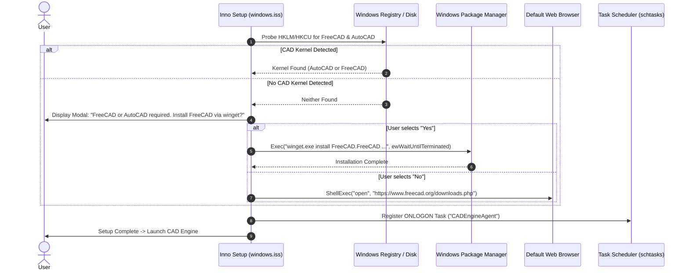
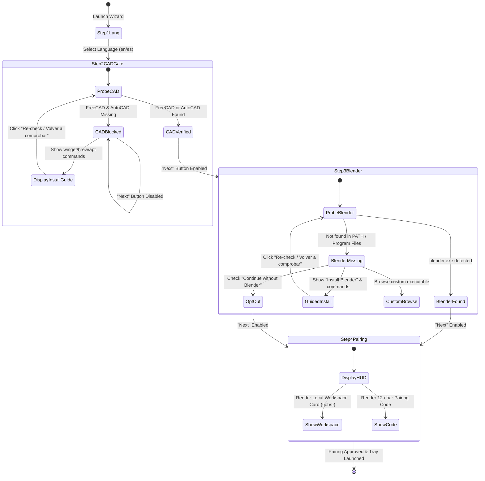
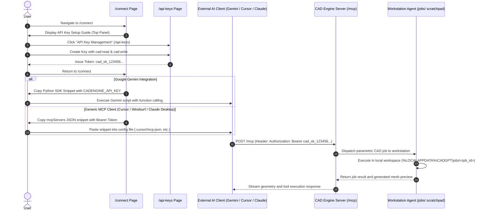

# Technical Design: CAD Engine Installer Workspace, CAD Prerequisite Gate & Connect Overhaul

**Change ID:** `cadengine-installer-workspace-cad-connect-gemini-mcp`  
**Target Version:** `v0.2.0-alpha.1`  
**Status:** In Review  

---

## 1. Context & Invariants

This design details the technical specifications and architecture for four major areas of CAD Engine: local workspace directory governance, CAD prerequisite enforcement with automated package remediation, a comprehensive Connect page overhaul (`/connect`) supporting Google Gemini and Generic MCP clients, and release packaging standardization on the 4 principal installers.

### Core Invariants
1. **Unbundled CAD Kernels**: FreeCAD and Blender binaries are **not** bundled inside the core installer (~67 MB) to prevent installer bloat beyond 1.5 GB. However, a parametric CAD kernel (FreeCAD or full AutoCAD) is strictly required to execute 3D modeling jobs.
2. **Workspace Isolation & Preservation**: Application binaries reside in system program files (`{autopf}\CAD Engine`), while user drawings, intermediate solids, and job logs reside in the user profile directory (`{localappdata}\CADGPT\jobs`). User data must be protected with `uninsneveruninstall` so uninstallation never deletes user CAD projects.
3. **Non-Bypassable CAD Gate**: The Onboarding Wizard must strictly prevent advancing past Step 2 across Windows, Linux, and macOS until at least one parametric CAD kernel (FreeCAD or AutoCAD) is detected and verified.
4. **100% Bilingual Parity**: Every new UI element, guide section, table header, button state, and error message across the web application (`translations.ts`) and desktop agent (`i18n.py`) must maintain complete symmetric translation across English (`en`) and Spanish (`es`).
5. **Principal Release Distribution**: The release packaging pipeline publishes strictly the 4 principal installers (`CADEngine-Setup-windows-x64.exe`, `CADEngine-macos-arm64.dmg`, `CADEngine-macos-x64.dmg`, and `cadengine-linux-x64.tar.gz`) plus `SHA256SUMS.txt`.

---

## 2. Technical Approach

```
+----------------------------------------------------------------------------------------------------+
|               CAD ENGINE INSTALLER, WORKSPACE & CONNECT OVERHAUL ARCHITECTURE                      |
+-----------------------------------+--------------------------------+-------------------------------+
|     1. WORKSPACE ARCHITECTURE     |    2. CAD PREREQUISITE GATE    |    3. CONNECT PAGE (/connect) |
| - windows.iss: [Dirs] uninsnever- | - FreeCAD unbundled (~67 MB)   | - API Key guide at top        |
|   uninstall on {localappdata}\jobs| - windows.iss Pascal script:   | - Link to /api-keys & scopes  |
| - UpdateReadyMemo separation      |   RegKeyExists + FindFirst     | - Google Gemini Python SDK    |
| - Agent GUI Step 4 workspace card | - CurStepChanged winget prompt | - Generic MCP (Cursor, Claude |
| - Tray on_view_status_hud() path  | - gui.py Step 2 gate & recheck |   Windsurf, Antigravity table)|
| - hud_workspace_dir in i18n       | - gui.py Step 3 Install Blender| - 100% EN/ES translation parity
+-----------------------------------+--------------------------------+-------------------------------+
|              4. PRINCIPAL INSTALLERS PIPELINE (Inno EXE, 2x macOS DMGs, Linux tar.gz)              |
+----------------------------------------------------------------------------------------------------+
```

### 2.1 Workspace Directory Architecture
- **Inno Setup (`packaging/windows.iss`)**:
  - Add `{localappdata}\CADGPT` and `{localappdata}\CADGPT\jobs` to the `[Dirs]` section with `Flags: uninsneveruninstall`.
  - Implement `UpdateReadyMemo` in Pascal script (`[Code]`) to present a clear structural separation to the user:
    - **Destination Location**: `{autopf}\CAD Engine` (machine-wide binaries, executables, workers).
    - **CAD Project & Workspace Directory**: `{localappdata}\CADGPT\jobs` (user models, `.FCStd`, `.dwg`, `.blend`, intermediate meshes).
    - Clarify that all CAD drawings remain strictly local and private on the workstation.
- **Desktop Agent GUI (`agent/cadgpt_agent/gui.py`)**:
  - Expose the resolved workspace path (`Path(user_data_dir("CADGPT", appauthor=False)) / "jobs"`) in:
    1. **Onboarding Wizard Step 4**: Dedicated card displaying the active workspace path, assuring users that designs and meshes persist locally.
    2. **System Tray Connection Status HUD (`on_view_status_hud`)**: Displays the active workspace directory alongside Server URL, Hostname, and Device ID.
  - Update `agent/cadgpt_agent/i18n.py` in both English and Spanish:
    - `hud_workspace_dir`: `"Workspace Directory: {path}"` / `"Directorio del Espacio de Trabajo: {path}"`.
    - `step4_workspace_label`: `"Local CAD Workspace:"` / `"Espacio de Trabajo CAD Local:"`.
    - `step4_workspace_hint`: `"All drawings (.FCStd, .dwg, .blend) and exported meshes remain strictly local on this computer."` / `"Todos los dibujos (.FCStd, .dwg, .blend) y mallas exportadas permanecen estrictamente locales en este equipo."`.

### 2.2 Multi-OS CAD Prerequisite Gate & Guided FreeCAD/Blender UX
- **Inno Setup Pascal Script Detection (`packaging/windows.iss`)**:
  - `IsAutoCADInstalled`: Inspects `HKEY_LOCAL_MACHINE` registry keys `SOFTWARE\Autodesk\AutoCAD` and `SOFTWARE\WOW6432Node\Autodesk\AutoCAD`.
  - `IsFreeCADInstalled`: Inspects registry keys under `HKLM` and `HKCU`, and probes filesystem directories via `FindFirst` across `{commonpf}\FreeCAD*` and `{localappdata}\Programs\FreeCAD*`.
  - `CurStepChanged(ssPostInstall)`: If neither FreeCAD nor AutoCAD is detected:
    - Displays an informative modal confirmation box explaining that CAD Engine requires FreeCAD or AutoCAD.
    - If user clicks **Yes**: Runs `winget.exe install FreeCAD.FreeCAD --accept-package-agreements --accept-source-agreements` synchronously via `Exec(..., ewWaitUntilTerminated)`.
    - If user clicks **No**: Opens the official download portal (`https://www.freecad.org/downloads.php`) via `ShellExec`.
- **Onboarding Wizard Step 2 (CAD Gate)**:
  - Enforces non-bypassable blocking: `can_advance_from_step(2)` returns `False` if neither FreeCAD nor AutoCAD is detected.
  - Renders OS-specific guided install commands (`winget install FreeCAD.FreeCAD` on Windows, `brew install --cask freecad` on macOS, `sudo apt install freecad` on Linux) with copy actions.
  - Features an instant "Re-check / Volver a comprobar" button that calls `self.controller.refresh_discovery()` in-memory without losing wizard progress.
- **Onboarding Wizard Step 3 (Blender Discovery & Guided UX)**:
  - Adds an explicit "Instalar Blender" / "Install Blender" button opening `https://www.blender.org/download/`.
  - Displays copyable OS-specific install commands (`winget install BlenderFoundation.Blender`, `brew install --cask blender`, `sudo apt install blender`).
  - Provides a custom executable browser button (`filedialog.askopenfilename`) saving to `config.json["blenderPath"]`.
  - Adds an instant "Re-check / Volver a comprobar" button calling `self.controller.refresh_discovery()`.
  - Preserves the "Continue without Blender" opt-out checkbox.

### 2.3 Connect Page Architecture (`/connect`)
- **API Key Setup Guide (Top Panel)**:
  - Direct router link to `/api-keys`.
  - Explicit scope guidance: `cad:read` (geometry, scene inspection, device status, mesh exports) and `cad:write` (solids creation, booleans, transformations).
  - Copyable HTTP header snippet: `Authorization: Bearer <your_api_key>` with instant visual feedback.
- **Google Gemini Integration Guide**:
  - Documentation for connecting Gemini 2.5 Flash / 1.5 Pro via Google GenAI Python SDK (`google-genai`), Vertex AI, or Gemini CLI.
  - Copyable Python SDK snippet showing `genai.Client()`, endpoint `https://cadengine.danny-armijos.com/mcp`, and tool configuration.
- **Generic MCP Client Integration Guide**:
  - Standard `mcpServers` JSON configuration snippet with endpoint and Authorization header.
  - Client configuration matrix table detailing exact filesystem configuration paths:
    - **Cursor**: `.cursor/mcp.json`
    - **Windsurf**: `~/.codeium/windsurf/mcp_config.json`
    - **Claude Desktop**: `~/Library/Application Support/Claude/claude_desktop_config.json` (macOS) / `%APPDATA%\Claude\claude_desktop_config.json` (Windows)
    - **Antigravity / Gemini CLI**: `~/.gemini/antigravity-cli/mcp/`
- **100% Bilingual Translation Parity**:
  - Symmetric keys across `en` and `es` in `apps/web/src/app/core/i18n/translations.ts`.
  - Dynamic switching supported via `TranslatePipe` without full-page refresh.

### 2.4 Principal Installers Pipeline
- **Release Matrix Alignment**:
  - Restrict `.github/workflows/release.yml` and `packaging/build.py` to the 4 principal installers:
    1. `CADEngine-Setup-windows-x64.exe` (Inno Setup)
    2. `CADEngine-macos-arm64.dmg` (macOS Apple Silicon)
    3. `CADEngine-macos-x64.dmg` (macOS Intel)
    4. `cadengine-linux-x64.tar.gz` (Linux x86_64 tarball)
    - Plus `SHA256SUMS.txt`.
  - Omit WiX v4 MSI from the primary release pipeline, removing external .NET tool dependencies from the Windows CI runner.

---

## 3. Architecture Decisions (ADRs)

| ADR ID | Decision & Alternatives Considered | Rationale |
|---|---|---|
| **ADR-1: Workspace Working Directory in Inno Setup `[Dirs]`** | **Choice**: Declare `{localappdata}\CADGPT\jobs` in `[Dirs]` with `Flags: uninsneveruninstall` and describe in `UpdateReadyMemo`.<br>*Alternatives considered*: Storing jobs inside `C:\Program Files\CAD Engine\jobs`; letting Python create directories on first run without installer declaration. | Program Files requires admin elevation, failing non-elevated worker writes. Marking `uninsneveruninstall` guarantees that uninstalling or upgrading CAD Engine never deletes user CAD designs. |
| **ADR-2: Pre-Launch CAD Prerequisite Check in Inno Setup** | **Choice**: Implement Pascal script in Inno Setup checking registry/disk for FreeCAD/AutoCAD; prompt user to launch `winget install FreeCAD.FreeCAD` or download page.<br>*Alternatives considered*: Bundling FreeCAD directly in installer (>1.5 GB); failing silently and letting agent fail on launch. | Bundling FreeCAD bloats the installer by 25x. Automated `winget` remediation provides a seamless 1-click install on modern Windows 10/11 without installer bloat. |
| **ADR-3: Parametric CAD Gate vs Blender Discovery Separation** | **Choice**: FreeCAD/AutoCAD is a hard blocking gate (Step 2); Blender is optional with opt-out and custom path config (Step 3).<br>*Alternatives considered*: Making Blender mandatory; making FreeCAD optional. | CAD Engine's core mission is precision parametric modeling (CSG, STEP, DWG). Organic mesh modeling via Blender is complementary but not universally required. |
| **ADR-4: Connect Page Three-Tier Guide Hierarchy** | **Choice**: Place API Key guide prominently at the top; followed by Google Gemini; followed by Generic MCP matrix; followed by direct connectors.<br>*Alternatives considered*: A single monolithic connector list; hiding API keys in user settings only. | API keys and Bearer authentication are prerequisites for all external AI connectors (Gemini, Claude, Cursor). Users need to understand scope delegation before configuring client JSON. |
| **ADR-5: Standardization on 4 Principal Installers** | **Choice**: Publish strictly Inno Setup EXE, 2x macOS DMGs, Linux tar.gz, and SHA256SUMS.txt.<br>*Alternatives considered*: Continuing to build both WiX MSI and Inno EXE on Windows; publishing redundant legacy `CADGPT-*` archives. | Inno Setup provides native registry checking, `winget` execution, and scheduled task integration without external .NET SDK dependencies. Eliminates user confusion from redundant archives. |

---

## 4. Data Flow & State Transitions

### 4.1 Installer Post-Install CAD Verification & Winget Flow



### 4.2 Onboarding Wizard Step 2 & Step 3 State Transitions



### 4.3 Connect Page Client Onboarding & API Key Delegation Flow



---

## 5. Implementation Details & Technical Specifications

### 5.1 Inno Setup Script (`packaging/windows.iss`)

```pascal
[Dirs]
; User CAD workspace and drawings: uninsneveruninstall guarantees drawings are preserved on uninstall
Name: "{localappdata}\CADGPT"; Flags: uninsneveruninstall
Name: "{localappdata}\CADGPT\jobs"; Flags: uninsneveruninstall

[Code]
function NeedsAddPath(Param: string): boolean;
var
  OrigPath: string;
begin
  if not RegQueryStringValue(HKEY_LOCAL_MACHINE,
    'SYSTEM\CurrentControlSet\Control\Session Manager\Environment',
    'Path', OrigPath)
  then begin
    Result := True;
    exit;
  end;
  Result := Pos(';' + UpperCase(Param) + ';', ';' + UpperCase(OrigPath) + ';') = 0;
end;

function IsAutoCADInstalled: Boolean;
begin
  Result := RegKeyExists(HKEY_LOCAL_MACHINE, 'SOFTWARE\Autodesk\AutoCAD') or
            RegKeyExists(HKEY_LOCAL_MACHINE, 'SOFTWARE\WOW6432Node\Autodesk\AutoCAD');
end;

function IsFreeCADInstalled: Boolean;
var
  FindRec: TFindRec;
begin
  Result := RegKeyExists(HKEY_LOCAL_MACHINE, 'SOFTWARE\FreeCAD') or
            RegKeyExists(HKEY_CURRENT_USER, 'Software\FreeCAD') or
            RegKeyExists(HKEY_LOCAL_MACHINE, 'SOFTWARE\WOW6432Node\FreeCAD');
  if not Result then
  begin
    if FindFirst(ExpandConstant('{commonpf}\FreeCAD*'), FindRec) then
    begin
      try
        Result := True;
      finally
        FindClose(FindRec);
      end;
    end;
  end;
  if not Result then
  begin
    if FindFirst(ExpandConstant('{localappdata}\Programs\FreeCAD*'), FindRec) then
    begin
      try
        Result := True;
      finally
        FindClose(FindRec);
      end;
    end;
  end;
end;

function UpdateReadyMemo(Space, NewLine, MemoUserInfoInfo, MemoDirInfo, MemoTypeInfo, MemoComponentsInfo, MemoGroupInfo, MemoTasksInfo: String): String;
var
  S: String;
begin
  S := MemoDirInfo + NewLine + NewLine;
  S := S + 'CAD Project & Workspace Directory:' + NewLine;
  S := S + Space + ExpandConstant('{localappdata}\CADGPT\jobs') + NewLine;
  S := S + Space + '(All native CAD drawings .FCStd/.dwg remain strictly local)' + NewLine + NewLine;
  S := S + 'Background Service:' + NewLine;
  S := S + Space + 'Windows Task Scheduler ONLOGON Task (CADEngineAgent)' + NewLine;
  Result := S;
end;

procedure CurStepChanged(CurStep: TSetupStep);
var
  ResultCode: Integer;
begin
  if CurStep = ssPostInstall then
  begin
    if not (IsFreeCADInstalled or IsAutoCADInstalled) then
    begin
      if MsgBox('CAD Engine requires a parametric CAD kernel (FreeCAD or AutoCAD) to execute 3D modeling operations.' + #13#10 + #13#10 +
                'Neither FreeCAD nor AutoCAD was detected on this computer.' + #13#10 + #13#10 +
                'Would you like to install FreeCAD now using Windows Package Manager (winget)?' + #13#10 +
                '(Click "No" to open the official FreeCAD download page instead)',
                mbConfirmation, MB_YESNO) = IDYES then
      begin
        Exec('winget.exe', 'install FreeCAD.FreeCAD --accept-package-agreements --accept-source-agreements', '', SW_SHOW, ewWaitUntilTerminated, ResultCode);
      end
      else
      begin
        ShellExec('open', 'https://www.freecad.org/downloads.php', '', '', SW_SHOWNORMAL, ewNoWait, ResultCode);
      end;
    end;
  end;
end;
```

### 5.2 Agent GUI Workspace Transparency (`agent/cadgpt_agent/gui.py`)

#### A. Status HUD Workspace Display (`SystemTrayDaemon.on_view_status_hud`)
```python
    def on_view_status_hud(self) -> None:
        self.check_connection()
        self._refresh_engines()
        lang = get_language(self.config_path)

        workspace_dir = str((self.config_path.parent / "jobs").resolve())
        engines_str = ", ".join(self.active_engines) or "None detected"
        latency_str = f"{self.heartbeat_latency_ms}" if self.heartbeat_latency_ms is not None else "--"
        status_text = "Connected" if self.is_connected else "Disconnected"

        msg = (
            f"{t('hud_server_url', lang, url=self.server)}\n"
            f"{t('hud_hostname', lang, hostname=platform.node())}\n"
            f"{t('hud_device_id', lang, device_id=self.device_id or 'None')}\n"
            f"{t('hud_workspace_dir', lang, path=workspace_dir)}\n"
            f"{t('hud_active_engines', lang, engines=engines_str)}\n"
            f"{t('hud_latency', lang, latency=latency_str)}\n"
            f"{t('hud_status', lang, status=status_text)}"
        )

        if messagebox and TK_AVAILABLE:
            root = tk.Tk()
            root.withdraw()
            messagebox.showinfo(t("hud_title", lang), msg)
            root.destroy()
        else:
            print(f"--- Connection Status HUD ---\n{msg}")
```

#### B. Onboarding Wizard Step 4 Workspace Card (`OnboardingWizard._render_step4`)
```python
        # Workspace working directory information card
        ws_path = str((self.controller.config_path.parent / "jobs").resolve())
        ws_card = ttk.Frame(card, style="Card.TFrame", padding=12)
        ws_card.pack(fill="x", pady=(12, 0))

        ttk.Label(
            ws_card,
            text=t("step4_workspace_label", lang),
            font=("Helvetica", 9, "bold"),
        ).pack(anchor="w")

        ttk.Label(
            ws_card,
            text=ws_path,
            style="Code.TLabel",
        ).pack(anchor="w", fill="x", pady=(2, 4))

        ttk.Label(
            ws_card,
            text=t("step4_workspace_hint", lang),
            style="Sub.TLabel",
            wraplength=520,
        ).pack(anchor="w")
```

#### C. Onboarding Wizard Step 3 Guided Blender Installation
```python
def get_blender_install_guide_for_system() -> dict[str, str]:
    system = platform.system()
    if system == "Windows":
        return {
            "cmd": "winget install BlenderFoundation.Blender",
            "url": "https://www.blender.org/download/",
        }
    elif system == "Darwin":
        return {
            "cmd": "brew install --cask blender",
            "url": "https://www.blender.org/download/",
        }
    else:
        return {
            "cmd": "sudo apt install blender",
            "url": "https://www.blender.org/download/",
        }
```
In `_render_step3`:
- When Blender is missing, render:
  - Guided install command box with copy button.
  - Action buttons: "Instalar Blender" / "Install Blender", "Browse...", and "Re-check / Volver a comprobar".
  - Re-check button calls `_on_recheck_blender`, which executes `self.controller.refresh_discovery()` and re-invokes `self.show_step(3)`.

### 5.3 Connect Page Template (`apps/web/src/app/pages/connect/connect.html`)

```html
<!-- Prominent API Key Setup Guide at Top of Page -->
<section class="panel api-key-guide-panel" data-testid="api-key-guide">
  <div class="panel-header">
    <span class="status highlight">{{ 'connect.api_key_step_badge' | translate }}</span>
    <h2>{{ 'connect.api_key_guide_title' | translate }}</h2>
  </div>
  <p>{{ 'connect.api_key_guide_lead' | translate }}</p>

  <ol class="guide-steps">
    <li>
      {{ 'connect.api_key_step1_prefix' | translate }}
      <a routerLink="/api-keys"><strong>{{ 'connect.api_key_step1_link' | translate }}</strong></a>.
    </li>
    <li>
      {{ 'connect.api_key_step2_prefix' | translate }}
      <code>cad:read</code> {{ 'connect.api_key_step2_and' | translate }} <code>cad:write</code>
      {{ 'connect.api_key_step2_suffix' | translate }}
    </li>
    <li>
      {{ 'connect.api_key_step3_text' | translate }}
      <div class="snippet-box">
        <pre><code>Authorization: Bearer &lt;your_api_key&gt;</code></pre>
        <button
          type="button"
          class="quiet"
          (click)="copySnippet('Authorization: Bearer <your_api_key>', 'api-key-header')"
          [attr.aria-label]="'connect.copy_snippet' | translate"
        >
          {{ (copiedSnippet() === 'api-key-header' ? 'connect.snippet_copied' : 'connect.copy_snippet') | translate }}
        </button>
      </div>
    </li>
  </ol>
</section>

<!-- Google Gemini Integration Guide -->
<section class="panel" data-testid="gemini-steps">
  <div class="os-guide-header">
    <span class="status">{{ 'connect.gemini_badge' | translate }}</span>
    <h2>{{ 'connect.gemini_title' | translate }}</h2>
  </div>
  <p>{{ 'connect.gemini_subtitle' | translate }}</p>

  <div class="snippet-box">
    <pre><code>{{ geminiPythonSnippet() }}</code></pre>
    <button
      type="button"
      class="quiet"
      (click)="copySnippet(geminiPythonSnippet(), 'gemini')"
      [attr.aria-label]="'connect.gemini_copy_aria' | translate"
    >
      {{ (copiedSnippet() === 'gemini' ? 'connect.snippet_copied' : 'connect.copy_snippet') | translate }}
    </button>
  </div>
</section>

<!-- Generic MCP Client Integration Guide -->
<section class="panel" data-testid="generic-mcp-steps">
  <div class="os-guide-header">
    <span class="status">{{ 'connect.generic_mcp_badge' | translate }}</span>
    <h2>{{ 'connect.generic_mcp_title' | translate }}</h2>
  </div>
  <p>{{ 'connect.generic_mcp_subtitle' | translate }}</p>

  <div class="snippet-box">
    <pre><code>{{ genericMcpSnippet() }}</code></pre>
    <button
      type="button"
      class="quiet"
      (click)="copySnippet(genericMcpSnippet(), 'generic-mcp')"
      [attr.aria-label]="'connect.generic_mcp_copy_aria' | translate"
    >
      {{ (copiedSnippet() === 'generic-mcp' ? 'connect.snippet_copied' : 'connect.copy_snippet') | translate }}
    </button>
  </div>

  <table class="data mcp-paths-table">
    <thead>
      <tr>
        <th>{{ 'connect.mcp_client_col' | translate }}</th>
        <th>{{ 'connect.mcp_config_path_col' | translate }}</th>
      </tr>
    </thead>
    <tbody>
      <tr>
        <td><strong>Cursor</strong></td>
        <td><code>.cursor/mcp.json</code></td>
      </tr>
      <tr>
        <td><strong>Windsurf</strong></td>
        <td><code>~/.codeium/windsurf/mcp_config.json</code></td>
      </tr>
      <tr>
        <td><strong>Claude Desktop</strong></td>
        <td><code>~/Library/Application Support/Claude/claude_desktop_config.json</code> (macOS)<br><code>%APPDATA%\Claude\claude_desktop_config.json</code> (Windows)</td>
      </tr>
      <tr>
        <td><strong>Antigravity / Gemini CLI</strong></td>
        <td><code>~/.gemini/antigravity-cli/mcp/</code></td>
      </tr>
    </tbody>
  </table>
</section>
```

### 5.4 Connect Component Logic (`apps/web/src/app/pages/connect/connect.ts`)

```typescript
  readonly geminiPythonSnippet = computed(
    () => `# Google Gemini 2.5 / 1.5 with CAD Engine MCP Integration
import os
from google import genai
from google.genai import types

client = genai.Client()
CAD_API_KEY = os.environ.get("CADENGINE_API_KEY", "cad_sk_your_api_key_here")
CAD_ENDPOINT = "${this.resourceUrl}"

# Register CAD Engine operations as Gemini function declarations
response = client.models.generate_content(
    model="gemini-2.5-flash",
    contents="Model a mechanical mounting plate 100x50x10mm with 4 M5 corner holes in FreeCAD",
    config=types.GenerateContentConfig(
        tools=[...],  # Auto-mapped from CAD Engine tool schema
    ),
)
print(response.text)`,
  );

  readonly genericMcpSnippet = computed(
    () => `{
  "mcpServers": {
    "cadengine": {
      "url": "${this.resourceUrl}",
      "headers": {
        "Authorization": "Bearer YOUR_API_KEY"
      }
    }
  }
}`,
  );
```

---

## 6. Affected Files & File Changes Table

| File Path | Action | Description |
|---|---|---|
| `packaging/windows.iss` | Modify | Add `{localappdata}\CADGPT` and `jobs` to `[Dirs]` with `uninsneveruninstall`; add `UpdateReadyMemo` separating app binaries and workspace; implement `IsAutoCADInstalled`, `IsFreeCADInstalled`, and `CurStepChanged(ssPostInstall)` with `winget` remediation or download redirect. |
| `agent/cadgpt_agent/gui.py` | Modify | Expose active workspace path in Step 4 info card and `on_view_status_hud()`; enhance Step 3 with "Instalar Blender" button, guided install commands, copy action, custom browse, and instant Re-check button. |
| `agent/cadgpt_agent/i18n.py` | Modify | Add `hud_workspace_dir`, `step4_workspace_label`, `step4_workspace_hint`, `step3_install_cmd_label`, `step3_install_blender` in English and Spanish. |
| `apps/web/src/app/pages/connect/connect.html` | Modify | Add API Key Setup Guide at top of page, Google Gemini integration card, and Generic MCP configuration section with client configuration path table. |
| `apps/web/src/app/pages/connect/connect.ts` | Modify | Add `geminiPythonSnippet()` and `genericMcpSnippet()` computed signals; add snippet copy handlers with localized feedback. |
| `apps/web/src/app/pages/connect/connect.spec.ts` | Modify | Add unit test coverage for API key guide, Gemini card, generic MCP matrix, and full Spanish translation switching. |
| `apps/web/src/app/core/i18n/translations.ts` | Modify | Add symmetric translation keys for API Key guide, Google Gemini, and Generic MCP sections in `en` and `es`. |
| `.github/workflows/release.yml` | Modify | Ensure publication strictly builds the 4 principal packages (`.exe`, 2x `.dmg`, `.tar.gz`) without WiX MSI or legacy `CADGPT-*` archives. |
| `packaging/build.py` | Modify | Default `--skip-wix` in packaging script; ensure Inno Setup is the primary Windows builder. |
| `agent/tests/test_gui.py` | Modify | Add unit tests asserting workspace path inclusion in status HUD and Step 4 wizard rendering. |

---

## 7. Testing & Validation Strategy

### 7.1 Web Connect Page Tests (`apps/web/src/app/pages/connect/connect.spec.ts`)
- **API Key Guide Verification**: Verify that `api-key-guide` panel exists at the top, contains router link to `/api-keys`, details `cad:read` and `cad:write` scopes, and displays the Bearer syntax.
- **Google Gemini Snippet Verification**: Verify that `gemini-steps` panel renders valid Python snippet targeting `location.origin + '/mcp'`.
- **Generic MCP Matrix Verification**: Verify that `generic-mcp-steps` renders valid JSON configuration and lists Cursor (`.cursor/mcp.json`), Windsurf (`~/.codeium/windsurf/mcp_config.json`), Claude Desktop (`claude_desktop_config.json`), and Antigravity (`~/.gemini/antigravity-cli/mcp/`).
- **Translation Parity Test**: Switch language to Spanish (`es`) and assert that all new section titles, lead paragraphs, button labels, and table headers render in Spanish without fallback keys.

### 7.2 Desktop Agent GUI Tests (`agent/tests/test_gui.py`)
- **Workspace Transparency in Status HUD**: Mock `SystemTrayDaemon` and assert `on_view_status_hud` output contains `"Workspace Directory:"` (or `"Directorio del Espacio de Trabajo:"`) with path ending in `.../jobs`.
- **Step 4 Workspace Rendering**: Assert Step 4 renders the dedicated workspace container displaying the local jobs directory.
- **Step 2 CAD Prerequisite Blocking**: Assert that when `freecad_found` and `autocad_found` are both `False`, `can_advance_from_step(2)` returns `False`, and clicking Re-check (`refresh_discovery`) re-evaluates in-memory.
- **Step 3 Blender Guided Actions**: Assert that missing Blender renders install guide commands and browse controls.

### 7.3 Windows Installer Tests (`agent/tests/test_packaging.py`)
- **Inno Setup Script Parsing**: Verify `packaging/windows.iss` contains `uninsneveruninstall` on `{localappdata}\CADGPT\jobs`, declares `UpdateReadyMemo`, and implements `IsFreeCADInstalled` and `CurStepChanged`.
- **Dry-run Packaging**: Execute `python packaging/build.py --dry-run` to ensure all packaging assets validate cleanly.

### 7.4 Regression Test Execution
- Full frontend and API suites: `npm test` (all 156 api + 106 web tests pass).
- Full agent test suite: `python -m unittest discover -s agent/tests -v` (all 349+ tests pass).

---

## 8. Threat Matrix & Safety Considerations (STRIDE)

| Threat | STRIDE Category | Severity | Technical Mitigation |
|---|---|---|---|
| **User Data Loss during Uninstallation** | Denial of Service / Tampering | High | Inno Setup marks `{localappdata}\CADGPT\jobs` with `uninsneveruninstall`. CAD drawings, models, and job logs are strictly preserved across uninstalls and updates. |
| **Unauthorized File Writes via System Space** | Elevation of Privilege | High | Binaries are locked to `{autopf}\CAD Engine` (read-only for non-admin users). All runtime scratchpad files are strictly confined to `%LOCALAPPDATA%\CADGPT\jobs`. |
| **API Key Exposure in Shared Repositories** | Information Disclosure | High | Connect page explicitly reminds users that API keys should be stored in environment variables (`CADENGINE_API_KEY`) or user-private config files (`.cursor/mcp.json` added to `.gitignore`), never committed to public repositories. |
| **Stalled Unattended Setup on Missing CAD** | Denial of Service | Medium | Inno Setup runs CAD prerequisite checks in `ssPostInstall` with non-blocking user dialogs (`MB_YESNO`), skipping silently when executed with `/SILENT` or `/VERYSILENT` command-line flags. |
| **Malicious Executable Injection via Custom Blender Path** | Elevation of Privilege | Medium | Custom Blender paths are validated to ensure the target is an executable file before persisting in `config.json["blenderPath"]`. No administrative elevation is requested. |
| **Translation Desynchronization** | Spoofing / Usability | Low | Unit tests enforce strict symmetric translation keys across English and Spanish in `translations.ts` and `i18n.py`. |
