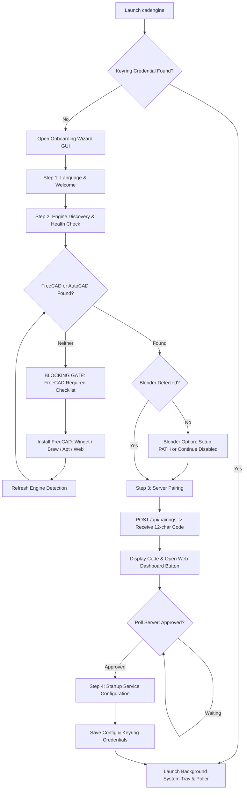

# Exploration: CAD Engine Phase 6 — Tray GUI, Blender Engine, Workspace Governance & File Integrity

**Change ID:** `cadengine-phase6-tray-gui-blender-workspace-integrity`  
**Target Release:** `v0.2.0-alpha.2`  
**Status:** Completed  
**Author:** sdd-explore subagent  

---

## 1. Executive Summary

Phase 6 marks a major evolution for **CAD Engine**, transforming it from a developer CLI tool and dual-CAD engine into an enterprise-ready, multi-paradigm 3D creation platform with a native system tray application, an interactive onboarding wizard, deep integration with Blender for organic/sculptural 3D modeling, standardized project hierarchy governance, and end-to-end file integrity validation gates.

This exploration rigorously investigates the existing codebase, evaluates architectural trade-offs, establishes technical invariants, and outlines a multi-slice implementation plan across four core pillars:

1. **Cross-Platform GUI Onboarding Wizard & System Tray App (Windows, macOS, Linux):**
   - Evaluates GUI frameworks to deliver a zero-runtime-bloat, native desktop onboarding wizard and background system tray process without bundling 200MB+ Qt runtimes.
   - Provides a multi-step onboarding wizard displaying pairing codes, web pairing URLs, real-time connection status, and prerequisite checks.
   - Enforces a **blocking requirement**: if neither FreeCAD nor AutoCAD is detected, pairing is blocked until FreeCAD is installed via guided or automated package managers.
   - Detects Blender installations with PATH configuration/elevation assistance or explicit opt-out.
   - Delivers full bilingual internationalization (**English** and **Spanish**) across both the agent GUI and the Angular web dashboard.
   - Implements a background system tray app featuring the website favicon (3D isometric CAD cube logo), pairing code inspection, connection health monitoring, unpair controls, and clean lifecycle management.

2. **Blender 3D Engine & Precision Organic Modeling Tools for AI Clients (MCP):**
   - Investigates the dual professional paradigms: **Architectural CAD Designer** (analytic B-Rep, millimeter CSG, DWG/DXF layering) versus **3D Modeler & Blender Artist** (quad topology, subdivision surfaces, organic sculpting, procedural displacement).
   - Reaffirms the core architectural invariant: **We do NOT embed an AI inside the MCP server.** The AI is the client (ChatGPT, Claude, cursor, etc.). The MCP server provides deterministic, structured tools to command CAD and Blender engines.
   - Introduces engine selection tools and guidance resources directing AI clients to the appropriate engine (AutoCAD for drafting, FreeCAD for parametric CSG, Blender for organic models).
   - Architectures a headless Blender worker (`blender --background --python blender_worker.py -- request.json result.json`).
   - Defines a 5-tool Blender catalog (`create_blender_mesh`, `extrude_subdivide_mesh`, `displace_sculpt_mesh`, `boolean_blender_mesh`, `export_blender_scene`) scaling from high-level macros for compact models to granular bmesh operations for frontier models.

3. **Project Directory Hierarchy & Governance:**
   - Standardizes project directory layouts under `projects/<id>/` with dedicated subdirectories: `cad/`, `meshes/`, `exports/`, `renders/`, and `references/`.
   - Establishes a metadata registry (`project.json` and API database integration) tracking asset inventory, file hashes, and relationships.
   - Implements non-destructive structure governance: detects disorganized files and requires explicit user consent before moving or reorganizing assets.

4. **File Integrity & Anti-Corruption Validation Gate:**
   - Develops an exhaustive binary STL validator enforcing the exact formula $\text{FileSize} = 84 + (50 \times N)$, header sanity, finite IEEE 754 coordinates (rejecting `NaN` and `Infinity`), and non-degenerate geometry bounds.
   - Introduces header magic validation for native CAD and 3D formats: DWG (`AC10xx`), FCStd (ZIP `PK\x03\x04` with `Document.xml`), and Blend (`BLENDER[-_][vV]xxx`).
   - Implements an integrity gate guarding mesh uploads, file downloads, and agent execution results.

```
+----------------------------------------------------------------------------------------------------+
|                                    CAD ENGINE PLATFORM (PHASE 6)                                   |
+-----------------------------------+--------------------------------+-------------------------------+
|    1. CROSS-PLATFORM GUI & TRAY   |    2. BLENDER ORGANIC ENGINE   |   3. WORKSPACE & INTEGRITY    |
|  - pystray + Tkinter (<2MB Bloat) |  - Architectural vs 3D Modeler |  - projects/<id>/ Governance  |
|  - Multi-Step Onboarding Wizard   |  - Headless `bpy` Worker Loop  |  - `cad/`, `meshes/`, etc.    |
|  - FreeCAD/AutoCAD Blocking Gate  |  - 5 Allowlisted Blender Tools |  - Non-Disruptive Audit Gate  |
|  - Blender Detection & Elevation  |  - Catmull-Clark & Displacement|  - Binary STL: 84 + 50*N      |
|  - Bilingual i18n (EN / ES)       |  - Engine Guidance for AI      |  - Magic Gate: DWG/FCStd/Blend|
|  - 3D Cube Favicon System Tray    |  - Macro vs Frontier Granular  |  - Pre-Upload / Pre-Serve Gate|
+-----------------------------------+--------------------------------+-------------------------------+
```

---

## 2. Current State (Verified in Codebase)

### 2.1 Agent Daemon & GUI Status
- **Current CLI Lifecycle ([agent/cadgpt_agent/main.py:1111-1200](file:///Users/danny/Documents/ChatGPT/CADGPT/agent/cadgpt_agent/main.py#L1111-L1200)):**
  - Launching `cadengine` without subcommands runs `run_foreground_loop(args)`.
  - When no server is configured, it falls back to a crude Tkinter `askstring` input box ([main.py:1121-1131](file:///Users/danny/Documents/ChatGPT/CADGPT/agent/cadgpt_agent/main.py#L1121-L1131)).
  - When pairing on macOS in frozen mode, it pops a rudimentary Tkinter `showinfo` alert box ([main.py:1189-1200](file:///Users/danny/Documents/ChatGPT/CADGPT/agent/cadgpt_agent/main.py#L1189-L1200)).
  - There is currently **no persistent system tray application** and **no graphical onboarding wizard**.
  - Once launched in the foreground, the terminal must remain open or the user must configure background tasks via `cadengine service install`.
- **Packaging ([packaging/build.py:84-121](file:///Users/danny/Documents/ChatGPT/CADGPT/packaging/build.py#L84-L121)):**
  - PyInstaller packages `cadengine` using `--console` on Windows/Linux and `--windowed` on macOS.
  - Dependencies collected include `keyring`, `platformdirs`, `cv2`, and `numpy`.
  - No system tray libraries (such as `pystray`) are currently collected or bundled in `pyproject.toml` or `packaging/build.py`.

### 2.2 CAD Engines & Discovery Pipeline
- **Discovery Engine ([agent/cadgpt_agent/discovery.py:115-193](file:///Users/danny/Documents/ChatGPT/CADGPT/agent/cadgpt_agent/discovery.py#L115-L193)):**
  - Discovers FreeCAD (`FreeCADCmd`, `freecadcmd`, `freecad`) across `PATH`, Windows Program Files, macOS `/Applications`, Linux `/usr/bin`, and Conda environments.
  - Discovers AutoCAD via Windows Registry (`HKLM\SOFTWARE\Autodesk\AutoCAD`), detecting `accoreconsole.exe` and distinguishing Full editions from LT.
  - Discovers **zero Blender installations**. Blender binaries (`blender`, `blender.exe`, `Blender.app`) are completely ignored.
- **Capabilities & Store Schema ([apps/api/src/store.ts:26-33](file:///Users/danny/Documents/ChatGPT/CADGPT/apps/api/src/store.ts#L26-L33)):**
  - `cadSchema` enforces `name: z.enum(['FreeCAD', 'AutoCAD'])`.
  - Reporting Blender currently causes schema validation failure in the NestJS/Express store during device registration and heartbeat.
- **Executor & Strategy Dispatch ([agent/cadgpt_agent/executor.py:15-16](file:///Users/danny/Documents/ChatGPT/CADGPT/agent/cadgpt_agent/executor.py#L15-L16)):**
  - `STRATEGIES` dictionary maps only `"FreeCAD": FreeCadStrategy()` and `"AutoCAD": AutoCadStrategy()`.
  - No strategy or headless worker exists for Blender.

### 2.3 Web Dashboard & Internationalization Status
- **Web Client ([apps/web/src/app/](file:///Users/danny/Documents/ChatGPT/CADGPT/apps/web/src/app/)):**
  - Modern Angular 19 standalone application with signals.
  - All text across pages (`home`, `pair`, `devices`, `designs`, `jobs`, `connect`, `keys`, `about`) is **100% hardcoded English**.
  - There is no i18n translation service, no language toggle button, and no localized translation dictionary for Spanish.
- **Pairing Flow ([apps/web/src/app/pages/pair/pair.html:1-19](file:///Users/danny/Documents/ChatGPT/CADGPT/apps/web/src/app/pages/pair/pair.html#L1-L19)):**
  - Prompts for a 12-character pairing code with English labels ("LINK A COMPUTER", "Pair your device", "Confirm & link device").

### 2.4 Document Storage & Project Layout
- **Agent Document Layout ([agent/cadgpt_agent/executor.py:70-86](file:///Users/danny/Documents/ChatGPT/CADGPT/agent/cadgpt_agent/executor.py#L70-L86)):**
  - Documents are stored in flat directories: `<root>/documents/<document_id>/`.
  - Native models are placed directly in the document directory root (`design.FCStd`, `design.dwg`).
  - Temporary jobs are placed in `<root>/jobs/<job_id>/`.
  - There is no standard directory structure for differentiating CAD solids, mesh geometry, export packages, renders, and reference blueprints.
  - No project metadata registry exists to audit file organization or prevent messy directory drift.

### 2.5 Mesh Upload & File Integrity Validation
- **Server-Side Validation ([apps/api/src/mesh.ts:41-50](file:///Users/danny/Documents/ChatGPT/CADGPT/apps/api/src/mesh.ts#L41-L50)):**
  ```typescript
  function isBinaryStl(size: number, header: Buffer): boolean {
    if (header.length < STL_HEADER_BYTES) return false;
    if (header.subarray(0, 6).toString('ascii') === 'solid ') return false;
    const facets = header.readUInt32LE(80);
    return size === STL_HEADER_BYTES + STL_FACET_BYTES * facets;
  }
  ```
  - Only verifies the exact byte length $84 + 50 \times N$ and checks that the first 6 bytes are not `"solid "`.
  - Does **not** inspect triangle facet floats for `NaN`, `Infinity`, or non-degenerate coordinates.
  - Does **not** validate magic headers for DWG (`AC10xx`), FreeCAD (`PK\x03\x04`), or Blender (`BLENDER`).
- **Agent-Side Upload Validation ([agent/cadgpt_agent/upload.py:48-58](file:///Users/danny/Documents/ChatGPT/CADGPT/agent/cadgpt_agent/upload.py#L48-L58)):**
  - Mirrors the server's basic check without deep coordinate verification.
  - Upload tests in `test_upload.py` currently pass null zero-bytes (`b"\x00" * (50 * facets)`) which represent degenerate geometry.

---

## 3. Technical Deep Dive & Architectural Pillars

---

### Pillar 1: Cross-Platform GUI Onboarding Wizard & System Tray App

#### 1.1 UI Framework Evaluation & Zero-Bloat Decision
To deliver a high-quality desktop experience across Windows, macOS, and Linux, three framework architectures were evaluated:

| Framework Option | Runtime Packaging Size | Native System Tray | OS Portability & Packaging | Verdict |
|---|---|---|---|---|
| **A. `pystray` + `tkinter` (`ttk`)** | **+1.8 MB** (negligible) | Native Win32 tray, macOS Menu Bar extra (`NSStatusBar`), Linux AppIndicator/Xlib. | Bundled in standard Python distributions. Seamless PyInstaller one-dir & one-file. WiX v4 MSI friendly. | **Selected Architecture**. Optimal balance of zero bloat, native OS tray, and cross-platform packaging. |
| **B. `PySide6` / Qt6** | **+180 MB to +260 MB** | Native QSystemTrayIcon across all platforms. | Massive C++ shared libraries (`Qt6Core`, `Qt6Gui`, `Qt6Widgets`), complex graphics dependencies (DirectX/Metal/OpenGL/Vulkan), signing headaches on macOS. | **Rejected**. Unacceptable binary bloat for a background workstation agent. |
| **C. `pywebview`** | **+35 MB to +65 MB** | No built-in system tray (requires `pystray` anyway). | Relies on system webview engines: Edge WebView2 (Windows), WKWebView (macOS), WebKitGTK (Linux). Severe dependency issues on Linux (WebKitGTK version mismatches across Ubuntu/Debian/Arch). | **Rejected**. Fragile runtime dependencies on Linux; redundant dual runtime. |

#### 1.2 Onboarding Wizard Flow & Blocking Dependency Gate
When `cadengine` is launched interactively without active credentials, it initializes the Onboarding Wizard (`cadgpt_agent.gui.wizard`).



##### 1.2.1 Blocking Dependency Gate for Parametric CAD
CAD Engine requires a parametric B-Rep CAD kernel (FreeCAD or AutoCAD) for manufacturing-grade engineering geometry.
- If neither `FreeCADCmd` nor `accoreconsole.exe` is found:
  - The wizard disables the "Next" / "Siguiente" progression button.
  - Clicking "Next" displays a blocking modal dialog:
    - **English:** *"CAD Engine requires a parametric CAD kernel to create 3D engineering models. Neither FreeCAD nor AutoCAD was detected on this machine. Please install FreeCAD (open-source & free) before pairing."*
    - **Spanish:** *"CAD Engine requiere un motor CAD paramétrico para crear modelos 3D de ingeniería. No se detectó FreeCAD ni AutoCAD en este equipo. Por favor, instale FreeCAD (gratuito y de código abierto) antes de vincular."*
  - Guided installation options provided directly in the UI:
    - **Windows:** Button to run `winget install FreeCAD.FreeCAD` or open `https://www.freecad.org/downloads.php`.
    - **macOS:** Button to run `brew install --cask freecad` or open the official DMG download.
    - **Linux:** Instruction snippet for `sudo apt install freecad` or Flathub link.
    - **Re-probe Button ("Volver a comprobar" / "Re-check"):** Instantly re-runs `discovery.discover()` without restarting the wizard.

##### 1.2.2 Blender Tool Detection & PATH Assistance
Blender powers the organic and sculptural modeling pipeline:
- The probe inspects default locations:
  - Windows: `C:\Program Files\Blender Foundation\Blender*\blender.exe`, `LOCALAPPDATA\Programs\Blender Foundation\...`, and `PATH`.
  - macOS: `/Applications/Blender.app/Contents/MacOS/Blender`, `~/Applications/...`, and `PATH`.
  - Linux: `/usr/bin/blender`, `/usr/local/bin/blender`, `/snap/bin/blender`, `flatpak`.
- If Blender is not detected:
  - The user is presented with two explicit choices:
    1. **"Enable Blender (3D Organic Modeling)" / "Habilitar Blender (Modelado Orgánico 3D)":** User can browse for an existing `blender.exe` or click to download. If Blender is located outside of `PATH`, the agent can persist its absolute path in `config.json["blenderPath"]` or offer admin elevation to update the system environment.
    2. **"Continue without Blender" / "Continuar sin Blender":** User opts out. Blender tools remain disabled, and the agent pairs successfully using only FreeCAD/AutoCAD.

#### 1.3 Background System Tray App
The system tray daemon (`cadgpt_agent.gui.tray`) maintains workstation connectivity in the background without cluttering the taskbar.

- **Tray Icon:** Derived from the CAD Engine 3D isometric cube logo (`apps/web/public/favicon.svg` / `favicon.ico`). Pre-rendered as high-DPI PNGs (16x16, 24x24, 32x32, 64x64) and `.ico` for Windows.
- **Cross-Platform Tray Behaviors:**
  - **Windows:** Standard Taskbar Notification Area icon. Supports left-click for quick status popover, right-click for full context menu, and balloon notifications for completed CAD jobs.
  - **macOS:** Menu Bar Extra item in the top-right system status bar. Adapts to macOS Dark Mode/Light Mode. Native Cocoa event loop integration.
  - **Linux:** AppIndicator3 with fallback to standard X11 notification area.
- **Menu Actions:**
  1. `[Status Header]` — Non-clickable indicator showing status: *"CAD Engine: Connected (v0.2.0-alpha.1)"*.
  2. `View Pairing Code` / `Ver código de vinculación` — Displays active pairing code if pending, or workstation device ID.
  3. `View Connection Status` / `Ver estado de conexión` — Opens a sleek HUD dialog displaying Server URL, Workstation Name, Device ID, Active Engines (FreeCAD, AutoCAD, Blender), and Heartbeat Latency.
  4. `Open Web Dashboard` / `Abrir Panel Web` — Spawns default browser to configured server URL.
  5. `Unpair Device...` / `Desvincular equipo...` — Displays a confirmation dialog: *"Are you sure you want to disconnect this device? Saved credentials will be removed."* Upon confirmation, calls `/api/devices/:id` revocation and deletes OS keyring credentials.
  6. `Exit / Quit` / `Salir` — Gracefully stops polling threads, unregisters tray icon, and terminates process.

#### 1.4 Bilingual Internationalization (i18n)
Both the agent GUI and the Angular web client support full English and Spanish localization with persistent language selection.

##### Agent GUI i18n (`cadgpt_agent/i18n.py`)
- Detects system language via `locale.getdefaultlocale()` (defaults to Spanish if system starts with `es_`, otherwise English).
- Language toggle switch (🇺🇸 EN / 🇪🇸 ES) in the wizard header allows instant UI language switching.
- Comprehensive dictionary covering wizard titles, descriptions, button labels, error strings, and tray menu labels.

##### Web Client i18n (`apps/web/src/app/core/i18n/`)
- A lightweight reactive `TranslationService` using Angular signals (`currentLang = signal<'en' | 'es'>('en')`).
- Stores preference in `localStorage.getItem('cadengine_lang')`.
- Language selector dropdown in `shell.html` header.
- Structural pipes/directives or signals providing instant translation of all views (`pair`, `devices`, `designs`, `jobs`, `about`).

---

### Pillar 2: Blender 3D Engine & Precision Organic Modeling Tools for AI Clients (MCP)

#### 2.1 Role Research: Architectural CAD vs. 3D Modeler & Blender Artist

```
+------------------------------------+------------------------------------+
|  ARCHITECTURAL CAD DESIGNER        |  3D MODELER & BLENDER ARTIST       |
+------------------------------------+------------------------------------+
| Primary Engines: AutoCAD, FreeCAD  | Primary Engine: Blender            |
| Mathematical Model: Analytic B-Rep | Mathematical Model: Polygonal Mesh |
| Tolerance: Millimeter (0.01-0.1mm) | Tolerance: Visual Curvature/Sub-D  |
| Primitives: Extrusions, CSG Solids | Primitives: Quad Cage, Subdivision |
| Features: Fillets, Chamfers, Holes | Features: Voxel Remesh, Sculpting  |
| Structure: DWG Layers, Blueprints  | Structure: Edge Loops, Deformation |
| Output: Manufacturing, CNC, BIM    | Output: CGI, Games, Visual Assets  |
+------------------------------------+------------------------------------+
```

- **Role 1: Professional Architectural CAD Designer:**
  - Operates in boundary representation (B-Rep) solids and exact 2D projection planes.
  - Requires exact dimensional constraints, planar alignments, non-negotiable millimeter tolerances, standard building wall thicknesses (100-300mm), and DWG layer governance (e.g., `A-WALL`, `A-DOOR`).
  - Booleans must produce mathematically closed, analytic solid manifolds.
- **Role 2: Professional 3D Modeler & Blender Artist:**
  - Operates on polygonal meshes governed by topology, edge loops, and curvature flow.
  - Prioritizes **all-quad topology** (quadrilateral faces) to ensure clean subdivision surface (Catmull-Clark) evaluation without pinch artifacts or non-planar creasing.
  - Utilizes procedural displacement textures (Voronoi, Musgrave, Perlin) and digital sculpting brushes to craft organic, ergonomic, and aesthetic geometries.
  - Manages deformation-ready topologies suitable for rigging and animation.

#### 2.2 Core Architectural Invariant
> [!IMPORTANT]
> **We do NOT embed an AI inside the MCP server.**  
> The AI is the external client (e.g., ChatGPT-4o, Claude 3.5 Sonnet, local open-weight LLMs). The MCP server is a strictly typed, deterministic tool provider that exposes capabilities to command CAD and Blender engines.

#### 2.3 Engine Selection & Guidance for AI Clients
When an AI client receives a user prompt to create or modify a 3D model, the MCP server provides guidance resources and a deterministic routing tool to ensure the proper engine is selected:

- **MCP Guidance Resource (`cadgpt://guidance/modeling-engine-selection`):**
  - Explains the operational strengths and boundaries of each engine:
    - Choose **AutoCAD** when generating 2D architectural layouts, floor plans, building permits, construction drawings, and standardized DWG/DXF files.
    - Choose **FreeCAD** when modeling mechanical parts, precision housings, fasteners, parametric assemblies, and functional parts destined for CNC milling or functional 3D printing.
    - Choose **Blender** when designing organic characters, ergonomic figurines, sculpted surfaces, artistic assets, cloth-like meshes, procedural terrain, or photorealistic scenes.
- **Engine Router Tool (`select_modeling_engine`):**
  - Analyzes design requirements (`domain`, `precision_required`, `aesthetic_style`) and returns recommended engine and tool parameters.

#### 2.4 Headless Blender Worker Architecture
Execution follows the exact subprocess isolation pattern proven with FreeCAD:

```
+------------------+         request.json         +------------------------+
|  cadgpt-agent    | ---------------------------> |     blender binary     |
| (Executor / Poller|                             |   (--background        |
|                  | <--------------------------- |    --factory-startup   |
+------------------+         result.json          |    --python worker.py) |
                                                  +------------------------+
                                                              |
                                                    Generates preview.stl
                                                    and design.blend
```

- **Command-line Invocation:**
  ```bash
  blender --background --factory-startup --python <agent_path>/blender_worker.py -- <job_dir>/request.json <job_dir>/result.json
  ```
  - `--background`: Runs completely headless without opening a display or X11 window.
  - `--factory-startup`: Ignores user-installed add-ons or customized default blend scenes, ensuring reproducible, deterministic script execution.
  - Subprocess execution enforced with a **120-second timeout** and streaming 4KB tail buffer capture for stderr/stdout diagnostics.

#### 2.5 Blender Tool Catalog (MCP)

##### 1. `create_blender_mesh`
Creates base mesh primitives with quad-dominant topology and optional initial subdivision.
- **Parameters:**
  - `name`: string (alphanumeric identifier).
  - `primitive_type`: `'cube' | 'cylinder' | 'uv_sphere' | 'icosphere' | 'torus' | 'monkey' | 'grid'`.
  - `dimensions`: `{ x: number, y: number, z: number }` (size in millimeters).
  - `subdivisions`: integer (0 to 4, default 0).
  - `location`: `{ x: number, y: number, z: number }` (position coordinates).
  - `smooth_shading`: boolean (default true).
  - `confirmed`: literal `true`.

##### 2. `extrude_subdivide_mesh`
Extrudes mesh geometry along surface normals and applies Catmull-Clark subdivision modifiers.
- **Parameters:**
  - `object_name`: string.
  - `extrude_distance`: number (millimeters).
  - `subdivision_levels`: integer (1 to 5).
  - `crease_edges`: boolean or number (0.0 to 1.0) to maintain sharp boundaries.
  - `confirmed`: literal `true`.

##### 3. `displace_sculpt_mesh`
Applies procedural texture displacement or voxel remeshing for organic surface relief.
- **Parameters:**
  - `object_name`: string.
  - `displace_strength`: number (millimeters offset).
  - `midlevel`: number (0.0 to 1.0, default 0.5).
  - `texture_type`: `'clouds' | 'voronoi' | 'wood' | 'marble' | 'musgrave'`.
  - `texture_scale`: number (frequency scaling factor).
  - `voxel_remesh_size`: optional number (mm, triggers OpenVDB remeshing when provided).
  - `confirmed`: literal `true`.

##### 4. `boolean_blender_mesh`
Executes mesh boolean operations between two objects in the scene.
- **Parameters:**
  - `target_object`: string.
  - `tool_object`: string.
  - `operation`: `'difference' | 'union' | 'intersect'`.
  - `solver`: `'exact' | 'fast'` (exact uses manifold BSP-tree arithmetic).
  - `confirmed`: literal `true`.

##### 5. `export_blender_scene`
Exports the Blender scene or selected objects to target interchange formats.
- **Parameters:**
  - `format`: `'stl' | 'obj' | 'gltf' | 'glb'`.
  - `apply_modifiers`: boolean (default true).
  - `confirmed`: literal `true`.

#### 2.6 Scalable Complexity for AI Models
- **Intuitive Macros for Lightweight Models:** A single call to `create_blender_mesh(primitive_type="monkey", subdivisions=2, smooth_shading=True)` creates, subdivides, and renders an organic object without requiring complex modifier chaining.
- **Granular BMesh & Modifier Control for Frontier Models:** Frontier models (GPT-4o, Claude 3.5 Sonnet) can execute multi-step organic pipelines:
  1. `create_blender_mesh` -> initialize base quad cage.
  2. `extrude_subdivide_mesh` -> extrude anatomical limbs with creased edge loops.
  3. `displace_sculpt_mesh` -> apply procedural noise texture for skin/rock textures.
  4. `boolean_blender_mesh` -> hollow internal cavities or carve assembly slots.
  5. `export_blender_scene` -> export glTF for web viewing and STL for printing.

---

### Pillar 3: Project Directory Hierarchy & Governance

#### 3.1 Standardized Directory Structure
To prevent file clutter, project workspaces are organized into a strict, standardized 5-folder hierarchy:

```
projects/<project-id>/
├── cad/                  # Native CAD/DCC files
│   ├── design.FCStd      # FreeCAD parametric tree
│   ├── design.dwg        # AutoCAD drawings & blocks
│   └── design.blend      # Blender scenes, modifiers & shaders
├── meshes/               # Tessellated surface geometry
│   ├── preview.stl       # High-resolution 3D print binary STL
│   └── preview.glb       # WebGL / Three.js compressed transmission format
├── exports/              # Production distribution packages
│   ├── assembly.step     # Standardized STEP AP214/AP242 exchange
│   └── layout.dxf        # 2D CNC laser/waterjet cut paths
├── renders/              # Previews, screenshots & ray-traced visuals
│   ├── thumbnail.png     # Web dashboard card visual (400x300)
│   └── render_cycles.png # High-fidelity offline render
└── references/           # Source materials & design inputs
    ├── blueprint.pdf     # Engineering drawing specification
    └── concept.png       # Inspiration image for vision pipeline
```

#### 3.2 Metadata Registry (`project.json`)
Every project directory contains an atomic `project.json` manifest registered in SQLite:
```json
{
  "projectId": "8b8e0e64-f6d2-4cfb-b8f2-1e649069d3e8",
  "name": "Robotic Gripper",
  "primaryEngine": "FreeCAD",
  "createdAt": "2026-09-17T02:00:00.000Z",
  "updatedAt": "2026-09-17T02:45:00.000Z",
  "version": "1.0.0",
  "inventory": [
    {
      "relativePath": "cad/design.FCStd",
      "category": "cad",
      "size": 48210,
      "sha256": "4a7d...39b1",
      "lastModified": 1758069900000,
      "magicVerified": true
    },
    {
      "relativePath": "meshes/preview.stl",
      "category": "meshes",
      "size": 150084,
      "sha256": "8f1c...902a",
      "lastModified": 1758069905000,
      "facetCount": 3000,
      "integrityVerified": true
    }
  ]
}
```

#### 3.3 Structure Governance & Permission Gate
- **Invariant:** **No existing user file is ever moved, renamed, or restructured without explicit authorization.**
- **Governance Audit (`audit_project_structure` tool):**
  - Scans project directory. Identifies disorganized files (e.g., `sketch.png` placed in root rather than `references/`, or legacy `documents/<id>/design.FCStd` flat structures).
  - Returns a detailed reorganization plan detailing planned source and destination paths.
- **Reorganization Gate (`reorganize_project_structure` tool):**
  - Requires explicit user authorization (`confirmed: true`).
  - Executes atomic `fs.rename` movements, preserves file timestamps, verifies path containment within the project root, and updates `project.json`.

---

### Pillar 4: File Integrity & Anti-Corruption Validation Gate

#### 4.1 Binary STL Integrity Validator
Binary STL files are prone to truncation, header spoofing, and invalid floating-point coordinates that crash downstream slicers or Three.js web viewers.

##### 4.1.1 Structural Formula Verification
A valid binary STL consists of:
1. **80-byte header** (arbitrary ASCII/binary description). Must not begin with `"solid "` (to avoid ASCII STL parsing ambiguity).
2. **4-byte facet count** $N$ (unsigned 32-bit integer, little-endian, located at bytes 80–83).
3. **Facet records:** Exactly $N$ facets, each occupying exactly 50 bytes.
   - Normal vector: 3x 32-bit float ($n_x, n_y, n_z$) = 12 bytes.
   - Vertex 1: 3x 32-bit float ($v1_x, v1_y, v1_z$) = 12 bytes.
   - Vertex 2: 3x 32-bit float ($v2_x, v2_y, v2_z$) = 12 bytes.
   - Vertex 3: 3x 32-bit float ($v3_x, v3_y, v3_z$) = 12 bytes.
   - Attribute byte count: 16-bit unsigned integer = 2 bytes.

The exact mathematical invariant for valid file size is:
$$\text{Expected File Size} = 84 + (50 \times N)$$

Any file where $\text{Actual File Size} \neq 84 + (50 \times N)$ is immediately rejected as corrupt or truncated.

##### 4.1.2 Deep Coordinate Sanity Checks
- **Finite Float Verification:** Every single float value in normal vectors and vertices must be finite (`math.isfinite()` / `Number.isFinite()`). Rejects files containing IEEE 754 `NaN`, `+Infinity`, or `-Infinity`.
- **Degenerate Geometry Check:** Rejects meshes where all vertices are $(0, 0, 0)$ or where triangle surface area is zero across all facets.
- **Engineering Bounds:** Checks that coordinate vertices reside within permissible manufacturing boundaries (e.g., $-100,000.0\text{ mm} \le x, y, z \le 100,000.0\text{ mm}$).

```python
def validate_binary_stl_stream(stream, file_size):
    if file_size < 84:
        raise ValueError("File is smaller than minimal binary STL header (84 bytes)")
    header = stream.read(84)
    if header[:6] == b"solid ":
        raise ValueError("ASCII STL detected; binary STL required")
    facet_count = struct.unpack_from("<I", header, 80)[0]
    expected_size = 84 + (50 * facet_count)
    if file_size != expected_size:
        raise ValueError(f"STL byte size mismatch: expected {expected_size}, got {file_size}")
    
    # Validate facets in chunks
    non_zero_coords = False
    for _ in range(facet_count):
        facet_bytes = stream.read(50)
        floats = struct.unpack("<12fH", facet_bytes)
        for val in floats[:12]:
            if not math.isfinite(val):
                raise ValueError("Corrupt STL: non-finite coordinate (NaN or Inf)")
            if abs(val) > 1e-6:
                non_zero_coords = True
    if facet_count > 0 and not non_zero_coords:
        raise ValueError("Corrupt STL: all coordinates are zero")
```

#### 4.2 Native CAD & 3D File Magic Header Validation
Before accepting, storing, or serving native project files, the integrity gate validates the file signature magic bytes:

| File Format | Header Magic Signature | Offset | Validation Rule |
|---|---|---|---|
| **DWG (AutoCAD)** | ASCII `AC10xx` | Bytes 0–5 | Must match valid AutoCAD release signatures: `AC1015` (2000), `AC1018` (2004), `AC1021` (2007), `AC1024` (2010), `AC1027` (2013), `AC1032` (2018–2026). |
| **FCStd (FreeCAD)** | Hex `50 4B 03 04` (`PK\x03\x04`) | Bytes 0–3 | Must match ZIP Local File Header magic; archive must contain valid `Document.xml`. |
| **Blend (Blender)** | ASCII `BLENDER` + Pointer (`-`/`_`) + Endian (`v`/`V`) + Version | Bytes 0–11 | Must match `^BLENDER[-_][vV][0-9]{3}$` (e.g., `BLENDER-v400` or `BLENDER_v306`). |

#### 4.3 Validation Gate Topology
The validation gate is enforced at three strategic boundaries:
1. **Agent Output Gate (`agent/cadgpt_agent/executor.py`):** Before reporting job completion, the agent validates generated meshes and scene files.
2. **Mesh Upload Gate (`apps/api/src/mesh.ts`):** Uploaded meshes are validated chunk-by-chunk during HTTP stream consumption before saving to disk.
3. **Download / Serve Gate (`apps/api/src/mesh.ts` & download endpoints):** Stored meshes and CAD files are validated before streaming bytes to client browsers or WebGL viewers.

---

## 4. Architectural Decisions & Alternatives (ADRs)

| ADR | Decision & Chosen Path | Alternatives Considered | Rationale |
|---|---|---|---|
| **ADR-1: Agent GUI & Tray** | **`pystray` + Tkinter (`ttk`)** | PySide6 / Qt6, `pywebview` | Tkinter is built into Python; `pystray` adds <2MB to PyInstaller binaries while providing true native system tray on Win/macOS/Linux. Qt adds 200MB+ bloat; `pywebview` has unstable Linux WebKitGTK dependencies. |
| **ADR-2: Blender Execution** | **Headless Subprocess (`blender --background --factory-startup`)** | Embedding Python `bpy` as a C-extension, Blender socket server | Standalone `bpy` wheel is difficult to compile cross-platform and conflicts with system Python. Background CLI execution guarantees process isolation, clean memory teardown, and works with standard Blender distributions. |
| **ADR-3: Parametric CAD Blocking Gate** | **Hard Block in Wizard: FreeCAD Required** | Soft warning allowing pairing without CAD, auto-downloading FreeCAD silently | Without a parametric CAD kernel, CAD Engine cannot fulfill core design jobs. Requiring FreeCAD up-front eliminates runtime job failures and provides guided package manager commands. |
| **ADR-4: Blender Installation Policy** | **Probe with Optional Opt-In / Out** | Mandatory Blender installation, silent PATH modification | Blender is a large download (~300MB). For users who only need architectural drafting or mechanical CAD, forcing Blender is unacceptable. Providing an opt-out preserves user choice. |
| **ADR-5: Workspace Hierarchy** | **Standardized 5-Folder Structure (`cad/`, `meshes/`, etc.)** | Flat directory, user-customizable folder schema | A standardized directory layout allows predictable tooling, automated export discovery, and clean web dashboard previews without config overhead. |
| **ADR-6: Non-Disruptive Governance** | **Explicit User Confirmation for Reorganization** | Automatic silent file moving | Moving files without user consent breaks external symlinks, scripts, and user workflows. Safe governance mandates user approval. |
| **ADR-7: File Integrity Validation** | **Exact $84 + 50 \times N$ + Finite Coordinates + Magic Bytes** | File extension check only, basic size check | Corrupted STL coordinates cause WebGL/Three.js buffer crashes and 3D printing failures. Deep validation guarantees pipeline safety. |
| **ADR-8: Bilingual i18n** | **Dual-Layer i18n (Python Dict + Angular Signal Service)** | GNU gettext / PO files, Angular `@angular/localize` compile-time | Runtime reactive dictionaries in Angular and Python avoid heavy build-time matrices and allow instant language switching without page reloads. |

---

## 5. Risks, Edge Cases & Mitigations

### 5.1 GUI Thread Blocking on macOS (Tkinter / Cocoa Main Loop)
- **Risk:** macOS strictly requires all GUI operations and Menu Bar event handling to occur on the main OS thread (`dispatch_main`). Running Tkinter or `pystray` on background threads can lead to Cocoa `SIGSEGV` crashes.
- **Mitigation:** Run the GUI event loop on the main thread. Run the network polling daemon and background job workers on dedicated background threads communicating via thread-safe queues (`queue.Queue`) and Tkinter `.after()` callbacks.

### 5.2 Blender Headless Execution Missing OpenGL / Mesa on Linux Servers
- **Risk:** Older Blender versions or certain modifiers (e.g., EEVEE render operations) may fail on headless Linux machines without a GPU or display server.
- **Mitigation:** For mesh generation and bmesh modifiers, Blender runs purely on CPU math without display context. When rendering or exporting, configure CPU Cycles engine or software Mesa rasterization (`LIBGL_ALWAYS_SOFTWARE=1`).

### 5.3 Windows UAC Elevation for Environment PATH Modification
- **Risk:** Modifying `System` PATH requires elevated administrator rights (`runas`), which may trigger UAC prompts that scare users or fail in restricted enterprise environments.
- **Mitigation:** First attempt modifying the `User` PATH environment (`HKCU\Environment\Path`), which does not require administrator privileges. If user PATH fails, store the discovered binary path directly in `config.json["blenderPath"]` so CAD Engine can invoke it directly without modifying global PATH.

### 5.4 Large STL Files Causing Validation Memory Spikes
- **Risk:** Loading a 100MB+ binary STL into memory to validate all triangle floats could trigger high memory usage or OOM errors.
- **Mitigation:** Validate STLs using streaming buffer chunks (e.g., 64KB buffers) or inspect header + facet count in $O(1)$, validating float coordinates sequentially with zero full-file buffering.

---

## 6. Proposed Slices & Implementation Roadmap

```
+----------------------------------------------------------------------------------------------------+
|                                    PHASE 6 IMPLEMENTATION ROADMAP                                  |
+------------------------------------+--------------------------------+------------------------------+
|  SLICE 1: GUI WIZARD & TRAY APP    |  SLICE 2: BLENDER MCP ENGINE   |  SLICE 3: WORKSPACE & GATES  |
|  - pystray + Tkinter GUI scaffold  |  - Blender discovery & config  |  - Standard 5-dir hierarchy  |
|  - Multi-step onboarding wizard    |  - Headless blender_worker.py  |  - project.json registry     |
|  - FreeCAD blocking checklist      |  - 5 Blender MCP tools (Zod)   |  - Audit & Reorganize tools  |
|  - Blender probe & elevation flow  |  - Engine guidance resources   |  - Binary STL validator      |
|  - Bilingual i18n (EN / ES)        |  - Sub-D & procedural displace |  - DWG/FCStd/Blend magic gate|
|  - 3D Cube Favicon System Tray     |  - Unit & mock execution tests |  - Upload & serve gate tests |
+------------------------------------+--------------------------------+------------------------------+
```

### Slice 1: Cross-Platform GUI Onboarding Wizard & System Tray App
1. Add `pystray` and `Pillow` dependencies in `agent/pyproject.toml`.
2. Implement bilingual i18n dictionary in `agent/cadgpt_agent/i18n.py` (English and Spanish).
3. Implement `cadgpt_agent/gui/wizard.py` with the 4-step setup flow:
   - Language selector & Welcome.
   - CAD Engine detection with FreeCAD blocking checklist.
   - Blender probe with PATH configuration or opt-out.
   - Pairing code display, web launch button, and live polling check.
4. Implement `cadgpt_agent/gui/tray.py` with the 3D cube logo icon and full menu actions.
5. Implement Angular `TranslationService` and language switcher in `apps/web/`.
6. Update PyInstaller and WiX packaging in `packaging/build.py` to bundle tray icons and assets.

### Slice 2: Blender 3D Engine & Precision Organic Modeling Tools (MCP)
1. Add Blender discovery logic in `agent/cadgpt_agent/discovery.py` and expand `store.ts` schema to include `'Blender'`.
2. Implement `agent/cadgpt_agent/blender_worker.py` handling bmesh operations, modifiers, and format exports.
3. Implement `agent/cadgpt_agent/strategies/blender.py` wrapping headless Blender subprocess execution.
4. Define and register the 5 Blender MCP tools in `apps/api/src/tools.ts` with strict Zod schemas.
5. Create MCP guidance resource `cadgpt://guidance/modeling-engine-selection` and guidance router tool in `apps/api/src/guidance.ts`.
6. Add unit and integration tests for Blender tool schemas and worker dispatch.

### Slice 3: Workspace Directory Governance & File Integrity Gates
1. Implement directory governance helper in `agent/cadgpt_agent/workspace.py` managing `cad/`, `meshes/`, `exports/`, `renders/`, `references/`.
2. Implement `audit_project_structure` and `reorganize_project_structure` MCP tools.
3. Implement deep binary STL validator ($84 + 50 \times N$ formula, finite floats, non-degenerate bounds) in `agent/cadgpt_agent/integrity.py` and `apps/api/src/integrity.ts`.
4. Implement header magic validators for DWG, FCStd, and Blend.
5. Wire validation gates into mesh upload (`apps/api/src/mesh.ts`), mesh serve, and agent result reporting.
6. Comprehensive test suite verifying corrupted STL rejection, magic header enforcement, and non-destructive workspace reorganization.
