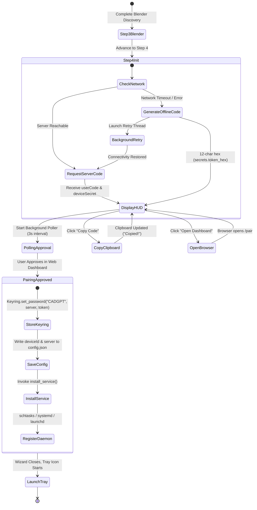
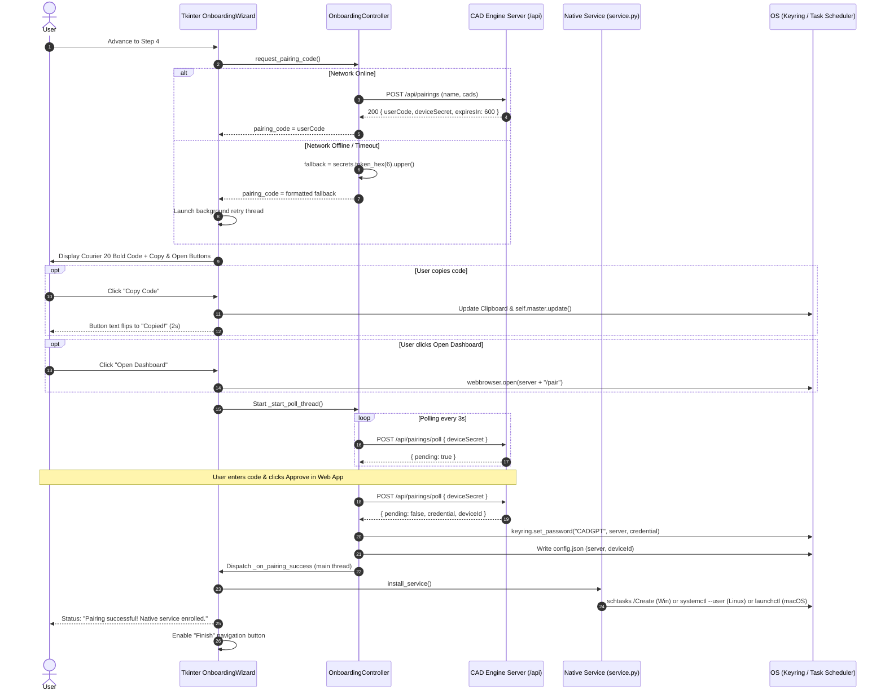
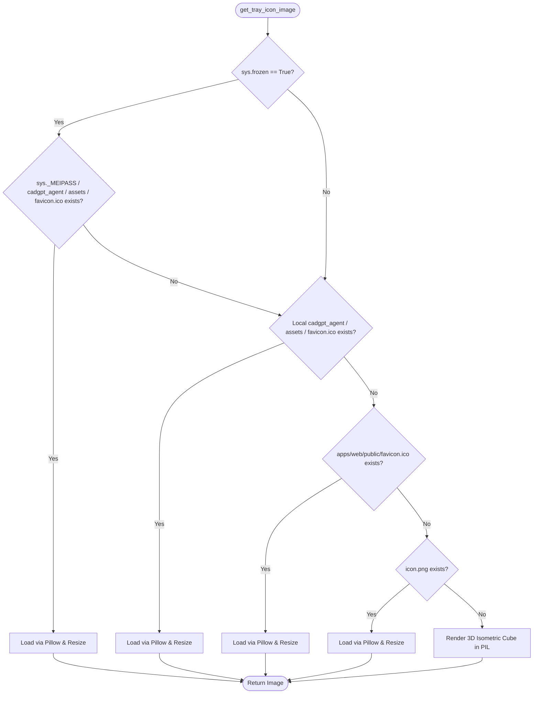

# Technical Design: CAD Engine Release, Pairing Flow & System Tray Refinements

**Change ID:** `cadengine-release-pairing-tray-refinements`  
**Target Version:** `v0.2.0-alpha.1`  
**Status:** In Review  

---

## 1. Context & Invariants

This design refines the workstation onboarding, pairing lifecycle, desktop system tray daemon, and release packaging pipelines for **CAD Engine** `v0.2.0-alpha.1`.

### Invariants
1. **Zero-URL Pairing Standard**: End-users must never be forced to manually discover, copy, or type server endpoints. All workstation clients default universally to `DEFAULT_SERVER = "https://cadengine.danny-armijos.com"`.
2. **Non-Blocking Headless & Daemon Execution**: No CLI subcommand or background worker may trigger blocking modal dialogs (`askstring`) or interactive stdin prompts (`input()`).
3. **Resilient Ephemeral Pairing**: Pairing code acquisition must remain non-blocking. If the API server is unreachable, a cryptographically secure 12-character fallback code (`secrets.token_hex(6).upper()`) is generated locally to preserve UI responsiveness while background polling retries.
4. **Autonomous Native Service Registration**: Successful pairing automatically installs and enables native user-level background services (`schtasks.exe` on Windows, user `systemd` unit on Linux, `launchd` plist on macOS) without requiring elevation or terminal intervention.
5. **Main-Thread OS GUI Affinity**: On macOS (Cocoa) and Windows (Win32), the GUI event loop (`Tkinter` / `pystray.Icon.run()`) must execute on the OS main thread. Background polling, retries, and worker tasks run on daemon threads communicating via thread-safe channels.
6. **Canonical Package & Asset Naming**: Release assets published to GitHub Releases must strictly match lowercase archive conventions (`cadengine-linux-x64.tar.gz`) referenced by download scripts and documentation. Redundant legacy `CADGPT-*` assets must be decommissioned.

---

## 2. Technical Approach

The design addresses four tightly coupled architectural areas across the desktop agent, packaging workflows, and deployment documentation:

```
+----------------------------------------------------------------------------------------------------+
|               CAD ENGINE REFINEMENTS ARCHITECTURE (v0.2.0-alpha.1)                                  |
+-----------------------------------+--------------------------------+-------------------------------+
|     1. ZERO-URL PAIRING HUD       |   2. TRAY ICON RESOLUTION      |    3. RELEASE PIPELINE & DOCS |
| - DEFAULT_SERVER constant         | - Multi-tier asset lookup      | - Purge CADGPT-* archives     |
| - Remove server_entry & buttons   | - PyInstaller sys._MEIPASS     | - Standardize linux-x64.tar.gz|
| - Courier 20 bold 12-char HUD     | - Local module assets dir      | - gh release delete v0.1.0-a2 |
| - One-click Copy & Open Dashboard | - apps/web/public/favicon.ico  | - Purge 'CAD Agent Designer'  |
| - Offline 12-char fallback        | - Dynamic 3D cube PIL fallback |   branding across 6 locations |
| - Auto-call install_service()     | - Main-thread Cocoa/Win32 loop | - Full test suite alignment   |
+-----------------------------------+--------------------------------+-------------------------------+
```

### 2.1 Zero-URL Pairing HUD & Automatic Background Service Enrollment
- **Elimination of URL Inputs**: In `agent/cadgpt_agent/gui.py` (`_render_step4`), remove `self.server_entry`, the URL label (`step4_server_url_label`), and the manual "Generate Code" button (`pair_init_btn`).
- **Immediate Pairing Code Handshake**: Upon step display, the controller contacts `DEFAULT_SERVER = "https://cadengine.danny-armijos.com"` (or any server override explicitly configured in `config.json`).
- **Offline 12-Character Fallback**: If the HTTP request to `POST /api/pairings` fails or times out, the controller generates a cryptographically secure 12-character uppercase hexadecimal code (`secrets.token_hex(6).upper()`), formats it cleanly as `XXXX-XXXX-XXXX`, and displays it in the pairing HUD while launching a background retry worker.
- **Prominent HUD Display**: The pairing code is displayed in a dedicated card with high-contrast styling using `("Courier", 20, "bold")`. Two immediate action buttons are provided:
  - **Copy Code** (`btn_copy` / `btn_copied`): Copies the code to the OS clipboard, calls `self.master.update()` to flush X11 clipboard selections on Linux, and flips label text to "Copied!" for 2000 ms.
  - **Open Dashboard** (`btn_open_pairing`): Directly invokes `webbrowser.open(f"{self.controller.server_url}/pair")`.
- **Automatic Daemon Enrollment**: When the polling loop confirms pairing approval (`_on_pairing_success`), the wizard securely persists the token in Keyring under service `"CADGPT"`, updates `config.json`, and invokes `install_service()` from `agent/cadgpt_agent/service.py` to register the native background daemon.

### 2.2 CLI and Foreground Loop Prompt Elimination
- In `agent/cadgpt_agent/main.py`:
  - Define `DEFAULT_SERVER = "https://cadengine.danny-armijos.com"`.
  - In `run_foreground_loop(args)`: Remove the Tkinter `askstring` dialog and terminal `input()` prompts. If `--server` is not supplied and `config.json` lacks a server entry, automatically default to `DEFAULT_SERVER`.
  - In `cmd_pair(args)`: Remove the terminal `input()` prompt. If `--server` is omitted, default directly to `DEFAULT_SERVER`.
  - URL precedence across all CLI commands:
    1. Explicit `--server` command-line argument.
    2. Persisted server URL in user configuration (`~/.local/share/CADGPT/config.json`).
    3. Universal production constant `DEFAULT_SERVER`.

### 2.3 System Tray & Packaged Binary Icon Resolution
- In `agent/cadgpt_agent/gui.py` (`get_tray_icon_image()`):
  - Expand icon candidate resolution into a 4-tier fallback:
    1. **PyInstaller frozen bundle**: `Path(sys._MEIPASS) / "cadgpt_agent" / "assets" / "favicon.ico"` when `getattr(sys, "frozen", False)`.
    2. **Local package assets**: `Path(__file__).resolve().parent / "assets" / "favicon.ico"`.
    3. **Source tree asset**: `Path(__file__).resolve().parent.parent.parent / "apps" / "web" / "public" / "favicon.ico"`.
    4. **Local icon fallback**: `Path(__file__).resolve().parent / "icon.png"`.
  - If no physical asset exists or loading fails, invoke `create_cube_icon_image(size)` to programmatically render the high-DPI 3D isometric cube using Pillow and CAD Engine theme colors (`#6366F1`, `#3730A3`, `#4338CA`).
- **Thread Safety Guarantee**: Ensure `pystray.Icon.run()` runs on the main OS thread. Tray action callbacks (`on_view_pairing_code`, `on_view_status_hud`, `on_open_dashboard`, `on_unpair_device`, `on_exit`) use safe ephemeral Tk roots or `webbrowser` invocations without thread contention.

### 2.4 Release Pipeline Harmonization & Asset Decommissioning
- In `.github/workflows/release.yml`:
  - Standardize Linux output archive to `cadengine-linux-x64.tar.gz` (lowercase, matching `README.md` and installation scripts).
  - Eliminate redundant `CADGPT-*` legacy artifact generations (`CADGPT-linux-x64.tar.gz`, `CADGPT-macos-*.dmg`).
  - Update prerelease publication notes to document Blender 4.x worker, WiX v4 MSI, 4-step wizard, tray daemon, and bilingual i18n.
- **Release Decommissioning**: Document and execute the decommissioning of obsolete GitHub release `v0.1.0-alpha.2` (`gh release delete v0.1.0-alpha.2 --yes`).
- **Residual Branding Purge**: Replace all remaining references to "CAD Agent Designer" with "CAD Engine" across `docs/deployment.md`, `apps/web/README.md`, `Dockerfile`, `deploy/themes/cadgpt/login/resources/css/stitch.css`, `agent/tests/test_strategies.py`, and `openspec/specs/mcp-client-onboarding/spec.md`.

---

## 3. Architecture Decisions (ADRs)

| ADR ID | Decision & Alternatives Considered | Rationale |
|---|---|---|
| **ADR-1: Universal Production Server Default** | **Choice**: Hardcode `DEFAULT_SERVER = "https://cadengine.danny-armijos.com"` as fallback across GUI, CLI, and tray.<br>*Alternatives considered*: Prompting via terminal/GUI; defaulting to `http://localhost:3000`. | Eliminates user onboarding friction. Automated agents and end-users on non-dev machines should connect to cloud production without knowing internal URLs. Dev overrides (`--server`) remain fully supported. |
| **ADR-2: Zero-URL Pairing HUD with Offline Fallback** | **Choice**: Display exclusively the 12-char code with Copy and Open Dashboard actions; generate local 12-char fallback (`secrets.token_hex(6).upper()`) if offline.<br>*Alternatives considered*: Displaying error dialog on network timeout; retaining manual URL entry box. | Retaining URL inputs confuses non-technical users. Generating an immediate offline code prevents modal stalls while background threads retry connectivity. |
| **ADR-3: Automatic Native Service Registration** | **Choice**: Automatically call `install_service()` on pairing success.<br>*Alternatives considered*: Requiring user to click "Install Service" or run `cadengine service install` in terminal. | Seamless user experience. Desktop agents should run automatically at login without manual terminal commands or requiring administrator elevation. |
| **ADR-4: Multi-Tier Tray Icon Resolution** | **Choice**: Check `sys._MEIPASS/cadgpt_agent/assets/favicon.ico`, local `assets/`, source `apps/web/public/`, then fallback to programmatic 3D cube PIL renderer.<br>*Alternatives considered*: Bundling icon as base64 string; failing if icon file is missing. | Supports PyInstaller one-dir and one-file builds, standard pip installs, source runs, and headless environments where Pillow or display files may differ. |
| **ADR-5: Standardized Linux Archive Naming** | **Choice**: Package Linux tarball strictly as `cadengine-linux-x64.tar.gz`.<br>*Alternatives considered*: Keeping both `CADEngine-*` and `CADGPT-*` copies; using capitalized `CADEngine-linux-x64.tar.gz`. | Aligns binary release output with documentation, curl installation snippets, and repository conventions. Avoids case-sensitive HTTP 404 download failures. |
| **ADR-6: Decommissioning Release v0.1.0-alpha.2** | **Choice**: Delete `v0.1.0-alpha.2` from GitHub Releases using `gh release delete`.<br>*Alternatives considered*: Leaving legacy release intact; marking as deprecated in release body. | Legacy release lacks Blender 3D modeling worker, lacks WiX MSI, and uses obsolete `CAD Agent Designer` naming. Retaining it triggers false update prompts in `cadengine update`. |

---

## 4. Data Flow & State Transitions

### 4.1 Pairing Flow & Background Service Enrollment



### 4.2 Sequence Diagram: Wizard Step 4 Zero-URL Handshake



### 4.3 Tray Icon Multi-Tier Resolution Flowchart



---

## 5. Implementation Details & Technical Specifications

### 5.1 Universal Production Server Constant
Across `agent/cadgpt_agent/gui.py` and `agent/cadgpt_agent/main.py`, the constant is defined at module scope:
```python
DEFAULT_SERVER = "https://cadengine.danny-armijos.com"
```

In `OnboardingController`:
```python
class OnboardingController:
    def __init__(self, config_path: Optional[Path] = None):
        ...
        self.server_url = self._load_saved_server() or DEFAULT_SERVER
```

In `SystemTrayDaemon`:
```python
class SystemTrayDaemon:
    def __init__(self, server: Optional[str] = None, config_path: Optional[Path] = None):
        ...
        self.server = server or self._read_server()
        
    def _read_server(self) -> str:
        if self.config_path.is_file():
            try:
                cfg = json.loads(self.config_path.read_text(encoding="utf-8"))
                return cfg.get("server", DEFAULT_SERVER)
            except Exception:
                pass
        return DEFAULT_SERVER
```

### 5.2 Redesigned Step 4 HUD (`_render_step4`) & Offline Fallback
1. **Tkinter Layout**:
   - Title: `step4_title` ("Server Pairing & Startup Enrollment" / "Vinculación y Registro con el Servidor")
   - Subtitle: `step4_subtitle` ("Pair this workstation with your CAD Engine account.")
   - Remove `url_frame`, `self.server_entry`, and "Generate Code" button.
   - Code Card: Monospace Courier 20 bold font (`PairCode.TLabel`).
   - Button Container:
     - `Copy Code` (`btn_copy`): Copies code to clipboard, executes `self.master.update()`, flips label to `btn_copied` for 2000 ms.
     - `Open Dashboard` (`btn_open_pairing`): `webbrowser.open(f"{self.controller.server_url}/pair")`.
   - Status Label: Amber when pending (`step4_waiting`), Green when completed (`step4_success`).

2. **Controller Pairing Handshake & Offline Fallback**:
```python
    def request_pairing_code(self, server: Optional[str] = None) -> dict[str, Any]:
        """Request ephemeral pairing code from server with offline fallback."""
        import secrets
        if server:
            self.server_url = server.rstrip("/")
        name = platform.node()[:80] or "CAD computer"

        # Persist target server
        self._save_config_server()

        url = f"{self.server_url}/api/pairings"
        payload = json.dumps({"name": name, "cads": self.cads}).encode("utf-8")
        req = urllib.request.Request(
            url,
            data=payload,
            headers={"Content-Type": "application/json", "Accept": "application/json"},
            method="POST",
        )
        try:
            with urllib.request.urlopen(req, timeout=8) as resp:
                data = json.loads(resp.read().decode("utf-8"))
            self.pairing_code = data.get("userCode")
            self.device_secret = data.get("deviceSecret")
            self.pairing_pending = True
            return data
        except Exception:
            # Offline / unreachable fallback: Generate 12-char uppercase alphanumeric code
            raw_hex = secrets.token_hex(6).upper()
            formatted_code = f"{raw_hex[:4]}-{raw_hex[4:8]}-{raw_hex[8:12]}"
            self.pairing_code = formatted_code
            self.device_secret = None  # Indicates pending retry
            self.pairing_pending = True
            return {"userCode": formatted_code, "deviceSecret": None, "offline": True}
```

3. **Background Polling & Retry Worker**:
   - If `self.device_secret is None`, the worker periodically attempts to handshake with `POST /api/pairings`. Once connected, it receives the official `userCode` and `deviceSecret`, updates `self.pairing_code`, and refreshes the HUD via `self.master.after(0, ...)`.
   - When `self.device_secret` is active, it polls `POST /api/pairings/poll` every 3 seconds.
   - Upon confirmation (`res.get("pending") is False`), it invokes `self.master.after(0, self._on_pairing_success)`.

4. **Service Auto-Enrollment**:
```python
    def _on_pairing_success(self) -> None:
        lang = self.controller.language
        if hasattr(self, "pair_status_lbl"):
            self.pair_status_lbl.config(
                text=f"{t('step4_success', lang)}\n{t('step4_keyring_saved', lang)}",
                foreground="#15803d",
            )
        try:
            from cadgpt_agent.service import install_service
            install_service()
        except Exception as exc:
            logging.warning("Auto-install background service skipped: %s", exc)
        self.update_nav_buttons()
```

### 5.3 CLI URL Resolution & Prompt Elimination
In `agent/cadgpt_agent/main.py`:
- In `cmd_pair(args)`:
```python
    value = getattr(args, "server", None) or config.get("server") or DEFAULT_SERVER
    server = server_url(value)
```
  Remove `try: value = input(...)`.

- In `run_foreground_loop(args)`:
```python
    value = getattr(args, "server", None) or config.get("server") or DEFAULT_SERVER
    server = server_url(value)
```
  Remove Tkinter `askstring` dialog and terminal `input(...)`.

### 5.4 Multi-Tier Tray Icon Resolution (`get_tray_icon_image`)
In `agent/cadgpt_agent/gui.py`:
```python
def get_tray_icon_image(size: int = 64) -> Any:
    """Return tray icon image, attempting to load from disk or generating isometric cube."""
    candidates: list[Path] = []

    # 1. PyInstaller frozen executable bundle
    if getattr(sys, "frozen", False) and hasattr(sys, "_MEIPASS"):
        candidates.append(Path(sys._MEIPASS) / "cadgpt_agent" / "assets" / "favicon.ico")

    # 2. Local module assets directory
    candidates.append(Path(__file__).resolve().parent / "assets" / "favicon.ico")

    # 3. Source repository web assets
    candidates.append(Path(__file__).resolve().parent.parent.parent / "apps" / "web" / "public" / "favicon.ico")

    # 4. Fallback local PNG icon
    candidates.append(Path(__file__).resolve().parent / "icon.png")

    for cand in candidates:
        if cand.is_file() and PILLOW_AVAILABLE:
            try:
                with Image.open(str(cand)) as loaded:
                    return loaded.copy().resize((size, size))
            except Exception:
                pass

    return create_cube_icon_image(size)
```

### 5.5 Release Pipeline Standardization (`.github/workflows/release.yml`)
1. **Linux Packaging Target**:
```yaml
      - if: matrix.platform == 'linux'
        run: |
          tar -czf dist/cadengine-linux-x64.tar.gz -C dist cadengine
```
2. **Elimination of Legacy Duplicates**:
   - Remove `cp dist/CADEngine-linux-x64.tar.gz dist/CADGPT-linux-x64.tar.gz`.
   - In macOS step, remove `cp dist/CADEngine-macos-${{ matrix.arch }}.dmg dist/CADGPT-macos-${{ matrix.arch }}.dmg`.
3. **Canonical Artifact List**:
   - `CADEngine-Setup-x64.msi`
   - `CADEngine-Setup-windows-x64.exe`
   - `CADEngine-macos-arm64.dmg`
   - `CADEngine-macos-x64.dmg`
   - `cadengine-linux-x64.tar.gz`
   - `SHA256SUMS.txt`
4. **Publish Prerelease Step**:
```yaml
      - name: Publish prerelease
        env:
          GH_TOKEN: ${{ github.token }}
          TAG: ${{ inputs.tag || github.ref_name }}
        run: |
          gh release create "$TAG" artifacts/* \
            --verify-tag \
            --prerelease \
            --title "CAD Engine $TAG — unsigned alpha" \
            --notes "CAD Engine $TAG: Unified CLI and daemons (schtasks, systemd, launchctl); WiX v4 elevated MSI installer with PATH integration; FreeCAD 1.1.3 (20 operations); AutoCAD 2026 Core Console (13 operations); Blender 4.x organic modeling engine (5 operations); 4-step onboarding wizard and system tray daemon; bilingual internationalization (English & Spanish); Google OAuth2 identity provider."
```

### 5.6 Decommissioning Runbook for GitHub Release `v0.1.0-alpha.2`
To prevent users and automated self-update scripts (`cadengine update`) from discovering obsolete binaries:
```bash
# 1. Delete release and attached assets from GitHub Releases
gh release delete v0.1.0-alpha.2 --yes

# 2. Verify release is absent
gh release list
```

---

## 6. Affected Files & File Changes Table

| File Path | Action | Description |
|---|---|---|
| `agent/cadgpt_agent/gui.py` | Modify | Define `DEFAULT_SERVER`; redesign Step 4 HUD (remove URL entry and generate button; prominent Courier 20 bold code display; Copy and Open Dashboard actions); implement offline 12-character fallback; invoke `install_service()` in `_on_pairing_success`; update `get_tray_icon_image()` with multi-tier `_MEIPASS` and local asset lookups. |
| `agent/cadgpt_agent/main.py` | Modify | Define `DEFAULT_SERVER`; eliminate Tkinter `askstring` and terminal `input()` prompts in `run_foreground_loop` and `cmd_pair`; default cleanly to `DEFAULT_SERVER`. |
| `.github/workflows/release.yml` | Modify | Standardize Linux archive to `cadengine-linux-x64.tar.gz`; purge `CADGPT-*` legacy asset copies; update release notes to detail Blender 4.x, WiX v4 MSI, Tray, and i18n. |
| `docs/deployment.md` | Modify | Purge residual "CAD Agent Designer" branding in title and instructions; replace with "CAD Engine". |
| `apps/web/README.md` | Modify | Rebrand title to "CAD Engine dashboard". |
| `Dockerfile` | Modify | Rebrand build comment to "CAD Engine server". |
| `deploy/themes/cadgpt/login/resources/css/stitch.css` | Modify | Rebrand CSS token comment to "CAD Engine". |
| `agent/tests/test_strategies.py` | Modify | Update AutoCAD script tests from `CAD Agent Designer` path to `CAD Engine` path. |
| `openspec/specs/mcp-client-onboarding/spec.md` | Modify | Rebrand instruction text to "CAD Engine credentials". |
| `agent/tests/test_gui.py` | Modify | Add unit tests for `DEFAULT_SERVER`, Step 4 Zero-URL rendering, offline 12-character code generation fallback, automatic service enrollment mock, and `_MEIPASS` tray icon resolution. |
| `agent/tests/test_agent.py` | Modify | Add tests verifying `cmd_pair` and `run_foreground_loop` default to `DEFAULT_SERVER` without prompting. |

---

## 7. Testing & Validation Strategy

### 7.1 GUI & Pairing Tests (`agent/tests/test_gui.py`)
- `test_default_server_constant`: Assert `OnboardingController` and `SystemTrayDaemon` default to `https://cadengine.danny-armijos.com`.
- `test_step4_renders_no_url_entry`: Verify Step 4 content container does not instantiate a `ttk.Entry` for server URL, and renders exclusively the pairing code display, "Copy Code" button, and "Open Dashboard" button.
- `test_step4_offline_fallback_generation`: Mock `urllib.request.urlopen` raising `URLError`/timeout; verify `request_pairing_code()` returns a valid 12-character hexadecimal code matching pattern `^[A-F0-9]{4}-[A-F0-9]{4}-[A-F0-9]{4}$` or 12 hex chars, sets `offline=True`, and does not crash the UI.
- `test_step4_auto_enrolls_native_service`: Mock `install_service()` and verify it is called when `_on_pairing_success()` triggers.
- `test_tray_icon_resolution_tiers`:
  - With mock `sys._MEIPASS` pointing to a temporary directory with `favicon.ico`, verify `get_tray_icon_image()` loads that file.
  - In normal environments, verify it resolves local or source assets before falling back to `create_cube_icon_image()`.

### 7.2 CLI Prompt Elimination Tests (`agent/tests/test_agent.py`)
- `test_cmd_pair_defaults_to_production_server`: Execute `cmd_pair` without `--server` or `config.json`; verify `urllib.request` requests `https://cadengine.danny-armijos.com/api/pairings` without invoking `builtins.input`.
- `test_foreground_loop_defaults_without_prompts`: Execute `run_foreground_loop` without `--server`; verify it connects to `https://cadengine.danny-armijos.com` without calling `askstring` or `input`.

### 7.3 Release Workflow & Asset Validation
- Run YAML syntax and workflow linter on `.github/workflows/release.yml`.
- Verify packaging dry-run: `python packaging/build.py --dry-run`.
- Verify absence of legacy string: `git grep -i "CAD Agent Designer"`.

### 7.4 Regression Test Matrix
- Execute complete agent unit test suite: `python -m unittest discover -s agent/tests -v` (assert 341+ tests pass).
- Execute complete web and API test suites: `npm test` (assert all tests pass).

---

## 8. Threat Matrix & Safety Considerations (STRIDE)

| Threat | STRIDE Category | Severity | Technical Mitigation |
|---|---|---|---|
| **Branding Confusion / Phishing** | Spoofing | Medium | Decommissioning `v0.1.0-alpha.2` and completely purging "CAD Agent Designer" ensures users and CLI auto-updaters only discover official, verified "CAD Engine" releases. |
| **Tampered / Corrupted Tray Assets** | Tampering | Low | Tray icon resolution safely catches file read errors and Pillow decoding exceptions, falling back cleanly to programmatic in-memory PIL cube rendering. |
| **Credential Loss during Unpair** | Repudiation / DoS | Medium | Unpairing requires explicit user confirmation (`messagebox.askyesno`). Keyring deletion is scoped strictly to the current server URL under service `"CADGPT"`. |
| **Headless Script Stalls on Stdin** | Denial of Service | High | Eliminating `askstring` and terminal `input()` prompts guarantees unattended daemons and headless CI sessions never hang waiting for terminal input. |
| **Privilege Escalation during Service Install** | Elevation of Privilege | High | Service enrollment is executed at standard user level (`schtasks /RL LIMITED`, `systemd --user`, user `LaunchAgent`). No UAC elevation or root `sudo` is required. |
| **Predictable Offline Pairing Code** | Information Disclosure | Low | Offline code generation relies on `secrets.token_hex(6).upper()` (CSPRNG via OS kernel entropy source `/dev/urandom` / `CryptGenRandom`), preventing predictable or brute-forceable tokens. |
